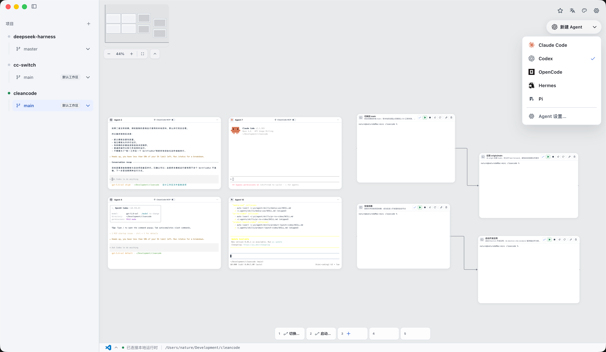
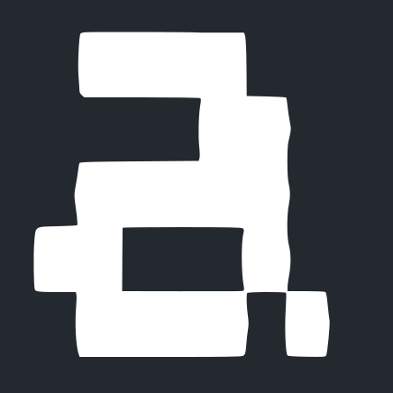
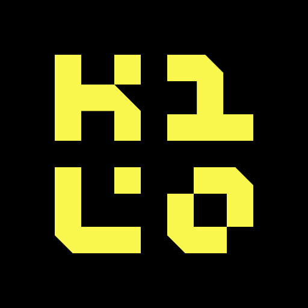
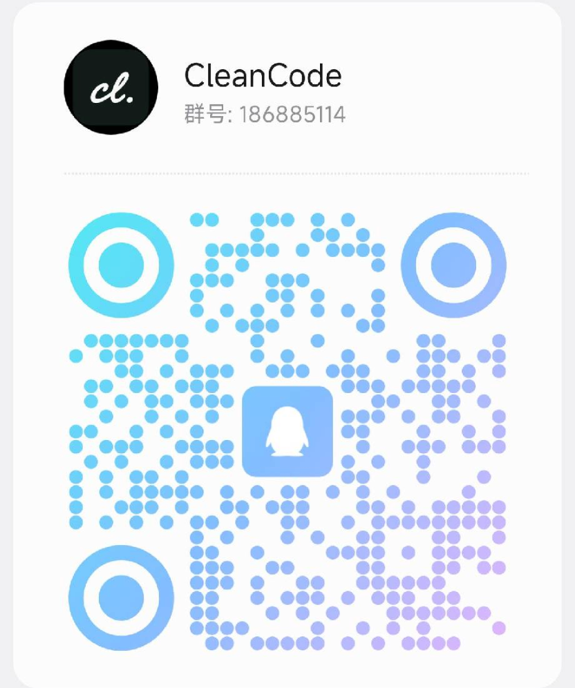

<h1 align="center">
   CleanCode
</h1>

<p align="center">
  <a href="./LICENSE"></a>
  <a href="https://github.com/chen-985211/cleancode/releases"></a>
  <a href="#quick-start"></a>
  <a href="#bring-your-favorite-agent"></a>
  <a href="#draw-it-and-run-it"></a>
</p>

<p align="center">
  <sub><a href="./README_ZH.md">简体中文</a> · <strong>English</strong></sub>
</p>

<p align="center">
  <strong>Give every development branch its own Agents, terminals, and executable workflow.</strong><br />
  Keep parallel work isolated, organize scattered development tools, and run them according to real dependencies.
</p>

<h3 align="center">
  <a href="https://github.com/chen-985211/cleancode/releases"><ins>Download CleanCode Preview (macOS / Windows / Linux)</ins></a>
</h3>

<p align="center">
  
</p>

<p align="center"><sub>Coding Agents, terminal tasks, long-running services, and real dependency connections in one branch workspace.</sub></p>

---

When you work on several changes at once, Coding Agents, terminals, development services, and working directories quickly scatter across different windows. After switching branches, you still have to confirm where each command is running, which services are already up, and which change each Agent is handling.

**cleancode is a canvas-first, local-first executable development workspace.** It keeps a separate canvas for local projects and Git branch workspaces, bringing interactive terminals, dependency workflows, and the Coding Agents you already use together so each change stays isolated, visible, and runnable.

cleancode is not a full IDE and does not provide a file tree or code editor. Keep using your existing editor, command-line tools, and Coding Agents; cleancode organizes the workspace around them and runs real local commands.

## One Branch, One Isolated Workspace

Create a branch workspace for `feature/auth`, and cleancode gives it a dedicated Git worktree. The canvas, terminals, execution scope, and Agent sessions all switch together with that workspace:

```txt
feature/auth (isolated worktree)
├── Coding Agent
└── Executable workflow
    └── Install dependencies ──> API service ──> Web app
                                               └─> Tests
```

Work on `feature/auth`, `fix/search`, and `experiment/new-ui` at the same time. When you return to a workspace, you do not need to clear terminals, recheck the working directory, or remind an Agent that you switched branches.

Running ordinary terminals keep working and retain their output while you switch to another change. If two branches need to start the same development service, preferred or automatic ports avoid manual conflicts: cleancode allocates an available port, injects it through the launch environment or command arguments, and shows the actual address for that run on the canvas.

## Draw It and Run It

A development environment usually takes more than one command: install or build first, wait for the API service to become ready, then start the web app and tests. cleancode makes those startup conditions part of the workflow instead of leaving them in script comments or human memory.

- Terminal blocks run real builds, tests, development servers, and everyday commands.
- Directed connections declare real dependencies. Tasks without upstream dependencies can start in parallel; downstream tasks wait until every direct dependency has completed or become ready.
- Finite tasks succeed or fail according to their exit codes, while long-running services become ready after matching output text or opening a TCP listener.
- Services can use fixed, preferred, or automatic ports; the runtime allocates and injects the final endpoint.
- An upstream failure explicitly blocks its descendants; stopping a workflow cleans up active processes in reverse dependency order.

The canvas shows node state, failure reasons, and actual service addresses, but it is not a static flowchart pretending to be runtime truth. Every run produces an immutable execution plan from the current terminal graph.

If the API service does not become ready in time, the web app and tests that depend on it do not start blindly. The canvas identifies the failed node, its blocked descendants, and the actual reason, so you can see where the workflow stopped without searching every terminal.

## Bring Your Favorite Agent

**Switch Agents without changing how you work.** cleancode does not introduce another built-in Coding Agent. It brings the local Agent CLIs you already use into the current branch workspace.

Agent integration has two levels: every built-in Provider can have its own console, while Agents that support the native cleancode MCP can also read, inspect, and build terminal workflows on the current canvas.

When you create an Agent, cleancode detects the Provider CLIs installed on your machine and only shows the Agents currently available.

<!-- agent-provider-wall:start -->

cleancode includes **33 Coding Agent Providers**. Each Agent runs the corresponding real local CLI in the current workspace directory; one workspace can host multiple Agents from the same or different Providers.

<p>
  <a href="https://docs.anthropic.com/claude/docs/claude-code"><kbd> Claude Code</kbd></a>
  <a href="https://developers.openai.com/codex/cli/"><kbd> Codex</kbd></a>
  <a href="https://opencode.ai/docs/cli/"><kbd> OpenCode</kbd></a>
  <a href="https://github.com/google-gemini/gemini-cli"><kbd> Gemini</kbd></a>
  <a href="https://cursor.com/cli"><kbd> Cursor</kbd></a>
  <a href="https://docs.github.com/en/copilot/how-tos/set-up/install-copilot-cli"><kbd> GitHub Copilot</kbd></a>
  <a href="https://github.com/openclaw/openclaw"><kbd> OpenClaw</kbd></a>
  <a href="https://hermes-agent.nousresearch.com/docs/"><kbd> Hermes</kbd></a>
  <a href="https://pi.dev"><kbd> Pi</kbd></a>
  <a href="https://docs.cline.bot/cline-cli/overview"><kbd> Cline</kbd></a>
  <a href="https://block.github.io/goose/docs/quickstart/"><kbd> Goose</kbd></a>
  <a href="https://aider.chat/docs/"><kbd> Aider</kbd></a>
  <a href="https://docs.continue.dev/guides/cli"><kbd> Continue</kbd></a>
  <a href="https://github.com/charmbracelet/crush"><kbd> Charm</kbd></a>
  <a href="https://kilo.ai/docs/cli"><kbd> Kilocode</kbd></a>
  <a href="https://github.com/QwenLM/qwen-code"><kbd> Qwen Code</kbd></a>
  <a href="https://www.kimi.com/code/docs/en/kimi-code-cli/getting-started.html"><kbd> Kimi</kbd></a>
  <a href="https://ampcode.com/manual#install"><kbd> Amp</kbd></a>
  <a href="https://x.ai/cli"><kbd> Grok</kbd></a>
  <a href="https://docs.factory.ai/cli/getting-started/quickstart"><kbd> Droid</kbd></a>
  <a href="https://antigravity.google/docs/cli-overview"><kbd> Antigravity</kbd></a>
  <a href="https://kiro.dev/docs/cli/"><kbd> Kiro</kbd></a>
  <a href="https://github.com/mistralai/mistral-vibe"><kbd> Mistral Vibe</kbd></a>
  <a href="https://mimo.xiaomi.com/coder"><kbd> MiMo Code</kbd></a>
  <a href="https://openclaude.gitlawb.com/"><kbd> OpenClaude</kbd></a>
  <a href="https://omp.sh"><kbd> OMP</kbd></a>
  <a href="https://devin.ai/cli"><kbd> Devin</kbd></a>
  <a href="https://docs.augmentcode.com/cli/overview"><kbd> Auggie</kbd></a>
  <a href="https://www.codebuff.com/docs/help/quick-start"><kbd> Codebuff</kbd></a>
  <a href="https://github.com/autohandai/code-cli"><kbd> Autohand Code</kbd></a>
  <a href="https://commandcode.ai/docs/quickstart"><kbd> Command Code</kbd></a>
  <a href="https://github.com/AntigmaLabs/ante-preview"><kbd> Ante</kbd></a>
  <a href="https://support.atlassian.com/rovo/docs/install-and-run-rovo-dev-cli-on-your-device/"><kbd> Rovo Dev</kbd></a>
</p>

**Keep using the Agents you already know, with the current branch, terminals, and runtime state in the same workspace.**

<!-- agent-provider-wall:end -->

## Let Agents Help You Build

Agents that support the native cleancode MCP understand and organize the same workspace through stable tools instead of editing internal canvas data. For example, you can tell an Agent:

> Inspect the current project and create terminals for installing dependencies, starting the API, and starting the web app. Configure the correct dependencies, service readiness conditions, and ports.

The Agent first inspects the existing canvas and, when needed, reads the project to confirm the real startup commands. It then uses MCP to create, configure, connect, and validate the complete workflow. The result lands on the canvas as one atomic change; inspect the terminals, dependencies, ports, and execution plan before deciding whether to run it.

Deleting blocks, dissolving groups, and disconnecting dependencies require approval in the cleancode UI. Starting and stopping workflows remain under human control. Agents can help build the environment, but actions that change your local development setup stay visible to you.

## Build Once, Reuse Anytime

Once the “install dependencies → API service → web app and tests” workflow is proven, save it as a project template. In the next branch, choose **Place** or **Place and run** to create a new set of terminals and connections with independent identities—without re-entering commands, ports, or startup order. Move the template to global favorites when you want to reuse it across projects.

Templates preserve configuration, dependencies, and relative layout, but they do not copy terminal output, runtime state, actual endpoints, Agents, or Agent conversations. You can also bind frequently used terminals, complete workflows, or combinations to slots `1` through `5` in the current workspace, then run them with `Command/Ctrl + 1` through `5`.

## Start with One Feature

1. Add a local project and create an isolated branch workspace for the feature.
2. Add the Coding Agent you use.
3. Turn installation, builds, tests, and development servers into terminal blocks.
4. Separate finite tasks from long-running services, then configure readiness conditions, ports, and dependencies.
5. Run the workflow from its root terminal and inspect startup order, state, failure reasons, and actual endpoints on the same canvas.
6. Save the proven terminal, workflow, or combination as a template, or bind it to a quick execution slot for next time.

## Quick Start

### Download the Preview

Download the installer for your platform from [GitHub Releases](https://github.com/chen-985211/cleancode/releases):

- macOS: Universal DMG/ZIP for both Apple Silicon and Intel.
- Windows: x64 NSIS installer.
- Linux: x64 AppImage/DEB.

> [!WARNING]
> The current Preview is not signed with official developer certificates. Download it only from this repository's GitHub Releases, and verify the package against `SHA256SUMS.txt` from the same release.

Because the app has not yet completed Developer ID signing and Apple notarization, macOS will block it the first time it opens. After moving `CleanCode.app` to `/Applications` and verifying the source and SHA-256 checksum, you can remove the download quarantine attribute for this app only and launch it:

```bash
xattr -dr com.apple.quarantine /Applications/CleanCode.app
open /Applications/CleanCode.app
```

This command bypasses the initial Gatekeeper check for this app. Do not replace the target with a broad path such as `/Applications`, your Downloads folder, or your home directory. Alternatively, follow [Apple's official instructions](https://support.apple.com/en-asia/102445) and choose **Open Anyway** under **System Settings → Privacy & Security**.

### Source Development Requirements

These requirements apply only when running from source or contributing to development. You do not need to install these development dependencies before downloading the Preview.

- Node.js `>= 24`
- pnpm `>= 10`
- macOS, Windows, or Linux

### Run Locally

```bash
git clone https://github.com/chen-985211/cleancode.git
cd cleancode
pnpm install
pnpm dev
```

### Common Checks

```bash
pnpm typecheck
pnpm test
pnpm pre-commit
```

### Build Locally

```bash
# Unpacked app for the current platform, intended for local verification
pnpm package

# Distribution installer for the current platform
pnpm dist

# You can also select a target explicitly on the corresponding operating system
pnpm dist:mac
pnpm dist:win
pnpm dist:linux
```

All artifacts are written to `release/`. macOS builds Universal DMG/ZIP packages, Windows builds an x64 NSIS installer, and Linux builds x64 AppImage/DEB packages. The user-facing app name is **CleanCode**, while the internal package name remains `cleancode`.

When you push a `v*` tag that matches the version in `package.json`, GitHub Actions builds on all three target operating systems, runs a packaged-terminal smoke test, and creates a public Preview Pre-release. The Preview does not yet use official developer certificates: macOS uses ad-hoc signing without notarization, and the Windows installer is unsigned, so the operating system may display security warnings. Until official signing is available, these artifacts are public testing builds.

## Current Limitations

cleancode is under active development. Keep these current limitations in mind:

- Executable block types currently remain terminal-centered, with terminal dependency workflows and terminal combinations. Preview, HTTP, Test, File, Plugin, and other standalone block types remain on the roadmap.
- Connections between terminals express startup dependencies only; they do not pass standard output, files, or structured artifacts between nodes.
- Agents can build, organize, and inspect terminal dependencies through MCP, but they cannot yet start, query, or stop workflows.
- Active workflows and Agent terminal processes do not continue running after the app exits. Recoverable terminals and upstream conversations reconnect according to their individual capabilities.
- Remote hosts, distributed execution, and cross-project workflows are not currently supported.
- The plugin extension system is not yet public, and third-party plugin compatibility is not guaranteed.
- The prebuilt packages on GitHub Releases are unsigned Preview builds, not signed production releases.

## Design Principles

- **The canvas is not the source of truth.** It only projects the domain model and runtime state.
- **People and Agents share the same use cases.** Agents do not bypass application boundaries to manipulate internal implementations.
- **Workspace isolation comes first.** Branches, directories, ports, and sessions must have explicit ownership.
- **Dangerous actions must be visible.** Capabilities that change processes, files, or workspace state require approval and auditing.
- **Failures must be explainable.** Plans, readiness, endpoints, and errors should map back to objects users can understand.

For architecture and domain boundaries, see the [Architecture Guide](./docs/engineering/architecture.md) and [Context Map](./docs/engineering/context-map.md).

## Documentation

- [Product Features and Quick Start](./docs/product/feature-guide.md)
- [Documentation Center](./docs/README.md)
- [UI Contract](./docs/product/ui-contract.md)
- [Terminal Dependency Workflows](./docs/contexts/run/terminal-workflow.md)
- [Agent and Session Lifecycle](./docs/contexts/agent/agent-session.md)
- [Native cleancode MCP](./docs/contexts/agent/cleancode-mcp.md)
- [Development Guidelines](./docs/engineering/development.md)

## Contributing

Issues, discussions, and pull requests are welcome. Before you begin, read the [Contributing Guide](./CONTRIBUTING.md) and [Development Guidelines](./docs/engineering/development.md).

## License

[MIT](./LICENSE)

---

<div align="center">
  <h2>Join the CleanCode Community</h2>

  <p>Talk workflows, Coding Agents, and developer experience—and share your feedback and ideas.</p>

  

  <p>
    <strong>QQ group: 186885114</strong><br />
    <sub>Scan with QQ, or search for the group number to join</sub>
  </p>
</div>
