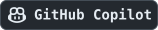
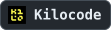
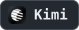
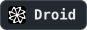
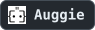
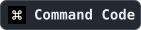
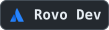
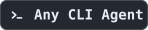

<h1 align="center">
   CleanCode
</h1>

<p align="center">
  <a href="./LICENSE"></a>
  <a href="https://github.com/chen-985211/cleancode/releases"></a>
  <a href="#快速开始"></a>
  <a href="#让-agent-回到开发现场"></a>
  <a href="#把依赖画出来然后跑起来"></a>
</p>

<p align="center">
  <sub><strong>简体中文</strong> · <a href="./README.md">English</a></sub>
</p>

<p align="center">
  <strong>一个画布式 ADE，把每个需求的 Agent、终端和工作流放进同一张可运行的开发现场。</strong><br />
  从分支隔离开始，保留上下文、运行状态和可以复用的开发经验。
</p>

<p align="center"><em>一个需求，一张可见、可执行的开发现场。</em></p>

<h3 align="center">
  <a href="https://github.com/chen-985211/cleancode/releases"><ins>下载 CleanCode Preview（macOS / Windows / Linux）</ins></a>
</h3>

<p align="center">
  
</p>

<p align="center"><sub>同一分支工作区中的 Coding Agent、终端任务、长驻服务与真实依赖连线。</sub></p>

<p align="center"><strong>▶ 完整演示（2:33，含声音）</strong></p>

https://github.com/user-attachments/assets/cafe373f-97b7-4f8c-b4a4-dfbc88ab26c3

---

软件开发正在从“一个人写代码”，变成“人和 Agent 一起推进多个开发现场”。一个需求可能有自己的分支、终端、服务、测试命令、端口和 Agent 对话；另一个需求也有一套类似的现场。问题不在于工具不够多，而是这些现场一旦散落到不同窗口里，人就必须不断靠记忆把它们重新拼起来：这个终端属于哪个分支，服务是否还活着，端口有没有冲突，依赖有没有就绪，Agent 现在理解的上下文是否还是当前需求。所以我越来越觉得，开发环境不应该只围绕代码文件和编辑器组织，而应该围绕一次正在推进的需求组织。它需要同时记住分支、终端、服务、端口、依赖顺序和 Agent 上下文，并且让这些东西以一种人能看懂、Agent 也能操作的方式存在。

**CleanCode 是一个画布式 ADE（Agentic Development Environment）。** 在 CleanCode 里，一次需求不只是一个分支名，而是一张可以继续工作的开发现场：Agent、终端、服务、端口和依赖关系都被放在同一张画布上。你能看见它们之间的关系，也能直接运行它们；当这套现场被跑通，它还可以被保存为项目模板或全局收藏，变成下一次开发可以直接复用的资产。

## 一个需求，一张开发现场

当你为 `feature/auth` 创建分支工作区时，CleanCode 不只是帮你切了一个 Git 分支，而是给这个需求开出了一块独立的开发现场。它有自己的 Git worktree，也有自己的画布、终端、运行作用域和 Agent 会话：

```txt
feature/auth（独立 worktree）
├── Coding Agent
└── 可执行工作流
    └── 安装依赖 ──> API 服务 ──> Web 应用
                              └─> 测试
```

所以你可以同时推进 `feature/auth`、`fix/search` 和 `experiment/new-ui`，而不是把它们挤在同一个终端历史和同一组服务状态里。回到任一工作区时，你看到的是这个需求自己的现场：终端输出还在，Agent 上下文还在，工作目录也没有变。

如果两个分支都要启动同一个开发服务，CleanCode 也会帮它们避开端口冲突。它可以使用固定、优选或自动端口，把最终端点注入启动环境或命令参数，并把实际访问地址显示在画布上。

## 把依赖画出来，然后跑起来

很多开发环境的问题，不是命令本身跑不起来，而是顺序和条件没有被环境记住：先安装依赖，等 API 服务真正就绪，再启动 Web 应用，最后跑测试。它们常常散落在 README、脚本注释、终端历史和人的记忆里。只要换一个分支，或者隔几天再回来，这套流程就要重新确认一遍。

在 CleanCode 里，这些启动条件会变成画布上的可执行工作流：

- 终端积木运行真实的构建、测试、开发服务器和日常命令。
- 有向连接声明真实依赖；没有上游的任务可以并行启动，下游等待全部直接依赖完成或就绪。
- 有限任务按退出码判断成功，长驻服务按输出文本或 TCP 监听判断就绪。
- 服务可以使用固定、优选或自动端口，由运行时分配并注入最终端点。
- 上游失败会明确阻塞后代；停止时按反向依赖顺序清理活动进程。

所以这张画布不是一张静态流程图。每次运行，CleanCode 都会从当前终端图生成一份不可变执行计划，并把节点状态、失败原因和实际访问地址留在画布上。

如果 API 服务没有在期限内就绪，依赖它的 Web 应用和测试不会盲目启动。你会直接看到流程停在哪个节点、哪些后代被阻塞，以及真正的失败原因。

## 跑通一次，沉淀为资产

当一套开发现场真正跑通以后，价值就不只在这一次需求里了。命令该怎么写、服务要等到什么状态、端口怎么避让、节点应该怎么摆放，这些东西其实都是一次次试出来的经验。过去它们很容易留在某个人的终端历史、聊天记录或脑子里；到了下一个分支，又要重新搭一遍。

在 CleanCode 里，验证过的终端、流程或组合可以保存为项目模板；如果它适合更多项目，也可以移到全局收藏。下一次遇到类似需求时，你可以选择“放置”或“放置并运行”，CleanCode 会创建一套拥有独立身份的新终端和连接，把命令、依赖关系、端口策略和相对布局一起带回来。

模板保存的是可复用的开发结构，而不是上一次运行的临时状态。它不会复制终端输出、运行状态、实际端点、Agent 或 Agent 对话。你也可以把常用终端、完整流程或组合绑定到当前工作区的 `1` 至 `5` 快捷执行位，再用 `Command/Ctrl + 1` 至 `5` 启动。

## 让 Agent 回到开发现场

如果 CleanCode 是一个 ADE（Agentic Development Environment），那它要解决的第一件事，就不是重新发明一个新的 Agent。你可能已经有自己顺手的工具：Claude Code、Codex、Gemini、Cursor、OpenCode，或者别的本地 Agent CLI。真正的问题是，这些 Agent 进入一个需求时，能不能和分支、终端、服务、端口、依赖关系站在同一个现场里。

**真正需要被保留下来的，不只是 Agent 本身，而是你和它之间已经形成的工作方式。** 你知道它适合什么时候直接改代码，什么时候应该先读项目，什么时候需要停下来问你；它也已经适应了你的命令行、权限习惯和上下文表达。让你换一个 Agent，表面上是在换工具，本质上是在重新磨合一套协作关系。

所以 CleanCode 不想把这些东西推倒重来。它不内置一个新的 Coding Agent，也不把你锁进一个封闭系统；它只是把你已经安装的本地 Agent CLI 放进当前分支工作区。这样 Agent 进入的就不是一个孤立的聊天窗口，而是当前需求真实发生的地方：正确的目录、同一张画布、正在运行的终端、服务、端口和依赖关系。

在这个基础上，Agent 有两种参与方式。所有内建 Provider 都可以拥有自己的控制台，用真实本地 CLI 在当前工作区运行；支持原生 CleanCode MCP 的 Agent，还可以在明确的工具边界里读取、检查和搭建画布上的终端工作流。新建 Agent 时，CleanCode 会检查本机已经安装的 Provider CLI，菜单里出现的不是一串理论支持列表，而是当前机器上真正可以启动的 Agent。

<!-- agent-provider-wall:start -->

这里有一个很关键的地方：CleanCode 并不是靠绑定某几个 Agent 来成立的。它的底座是终端，所以 **33 个 Coding Agent Provider** 更像是我们先替你铺好的入口：常见 Agent 的命令、图标、检测方式和默认参数已经整理好。

再往下看，只要一个 Agent 能从命令行启动，它理论上就可以先作为一个终端进程进入这张画布。你在终端里输入命令，把它跑起来，再用终端右上角的图钉把它钉在当前工作区里。这样它就不再只是某次对话里临时打开的一条命令，而是一个可以留在后台、继续工作的 Agent 现场。

<p>
  <a href="https://docs.anthropic.com/claude/docs/claude-code"></a>
  <a href="https://developers.openai.com/codex/cli/"></a>
  <a href="https://opencode.ai/docs/cli/"></a>
  <a href="https://github.com/google-gemini/gemini-cli"></a>
  <a href="https://cursor.com/cli"></a>
  <a href="https://docs.github.com/en/copilot/how-tos/set-up/install-copilot-cli"></a>
  <a href="https://github.com/openclaw/openclaw"></a>
  <a href="https://hermes-agent.nousresearch.com/docs/"></a>
  <a href="https://pi.dev"></a>
  <a href="https://docs.cline.bot/cline-cli/overview"></a>
  <a href="https://block.github.io/goose/docs/quickstart/"></a>
  <a href="https://aider.chat/docs/"></a>
  <a href="https://docs.continue.dev/guides/cli"></a>
  <a href="https://github.com/charmbracelet/crush"></a>
  <a href="https://kilo.ai/docs/cli"></a>
  <a href="https://github.com/QwenLM/qwen-code"></a>
  <a href="https://www.kimi.com/code/docs/en/kimi-code-cli/getting-started.html"></a>
  <a href="https://ampcode.com/manual#install"></a>
  <a href="https://x.ai/cli"></a>
  <a href="https://docs.factory.ai/cli/getting-started/quickstart"></a>
  <a href="https://antigravity.google/docs/cli-overview"></a>
  <a href="https://kiro.dev/docs/cli/"></a>
  <a href="https://github.com/mistralai/mistral-vibe"></a>
  <a href="https://mimo.xiaomi.com/coder"></a>
  <a href="https://openclaude.gitlawb.com/"></a>
  <a href="https://omp.sh"></a>
  <a href="https://devin.ai/cli"></a>
  <a href="https://docs.augmentcode.com/cli/overview"></a>
  <a href="https://www.codebuff.com/docs/help/quick-start"></a>
  <a href="https://github.com/autohandai/code-cli"></a>
  <a href="https://commandcode.ai/docs/quickstart"></a>
  <a href="https://github.com/AntigmaLabs/ante-preview"></a>
  <a href="https://support.atlassian.com/rovo/docs/install-and-run-rovo-dev-cli-on-your-device/"></a>
  
</p>

**你继续使用熟悉的 Agent；CleanCode 负责把这些 CLI 进程钉在一张可见、可运行、可长期停留的开发现场里。**

<!-- agent-provider-wall:end -->

## 让 Agent 搭建现场，但不让它越界

前面说，Agent 可以和终端、服务、端口站在同一张画布里。但站在现场，不代表它应该绕过你，直接改画布背后的数据。支持原生 CleanCode MCP 的 Agent 会通过稳定工具理解当前工作空间：它能看见已有终端和连接，能检查项目里的真实启动命令，也能按你的目标搭出新的终端工作流。

比如你可以直接告诉它：

> 帮我搭建一个启动项目的工作流。

Agent 会先检查现有画布，再读取项目，判断这个项目应该先安装什么、启动哪些服务、端口和依赖关系应该怎么连。最后落到画布上的不是一段建议，而是一套你可以看见、检查、继续运行的开发现场。

但这里有一条边界很重要：删除积木、解散组合、断开依赖这类会改变现场结构的动作，需要回到 CleanCode 界面中审批；启动和停止工作流，也仍然由人决定。Agent 可以参与搭建，但它不应该把本地开发环境变成一个黑箱。它做了什么、改了什么、下一步会运行什么，都应该留在你看得见的地方。

## 从一个需求，长出一张现场

使用 CleanCode 不需要先规划一套完整系统。你可以从当前正在做的一个需求开始：添加本地项目，为它创建独立分支工作区，然后带上你常用的 Coding Agent。

接下来，你可以自己把安装、构建、测试和开发服务器做成终端积木，也可以让支持 CleanCode MCP 的 Agent 先搭一版启动工作流。CleanCode 会把有限任务、长驻服务、就绪条件、端口和依赖关系放在同一张画布上，让这次需求从“一个分支”变成一张可以运行、检查和继续调整的现场。

当流程跑起来，你可以从根终端启动它，在画布上看到启动顺序、运行状态、失败原因和实际端点。等这套现场被验证过，再把终端、流程或组合保存为模板，或绑定到快捷执行位。下一次类似需求出现时，它就不再只是一次配置，而是一套可以直接复用的经验。

## 快速开始

如果你只是想先把 CleanCode 跑起来，不需要先理解所有概念，按下面几步就够了。

### 下载 Preview

从 [GitHub Releases](https://github.com/chen-985211/cleancode/releases) 下载对应平台的安装包：

- macOS：Universal DMG/ZIP，同时支持 Apple Silicon 和 Intel。
- Windows：x64 NSIS 安装程序。
- Linux：x64 AppImage/DEB。

> [!WARNING]
> 当前 Preview 尚未使用正式开发者证书签名。请只从本仓库的 GitHub Releases 下载，并先使用
> 同一 Release 中的 `SHA256SUMS.txt` 核对安装包。

macOS 会因为应用尚未完成 Developer ID 签名和 Apple notarization 而阻止首次打开。把
`CleanCode.app` 拖入 `/Applications`，确认安装包来源和 SHA-256 校验值无误后，可以只为这个
应用移除下载隔离属性并启动：

```bash
xattr -dr com.apple.quarantine /Applications/CleanCode.app
open /Applications/CleanCode.app
```

这条命令会绕过该应用的首次 Gatekeeper 检查。不要把目标路径替换为 `/Applications`、下载目录或
用户目录等宽泛范围。也可以按照
[Apple 官方说明](https://support.apple.com/en-asia/102445)，在“系统设置 → 隐私与安全性”中选择
“仍要打开”。

### 从源码运行的环境要求

以下要求只适用于从源码运行和参与开发；下载 Preview 不需要先安装这些开发依赖。

- Node.js `>= 24`
- pnpm `>= 10`
- macOS、Windows 或 Linux

### 本地运行

```bash
git clone https://github.com/chen-985211/cleancode.git
cd cleancode
pnpm install
pnpm dev
```

### 常用检查

```bash
pnpm typecheck
pnpm test
pnpm pre-commit
```

### 本地打包

```bash
# 当前平台的 unpacked 应用，用于本地验证
pnpm package

# 当前平台的发行安装包
pnpm dist

# 也可以在对应操作系统上显式选择平台
pnpm dist:mac
pnpm dist:win
pnpm dist:linux
```

产物统一写入 `release/`。macOS 生成 Universal DMG/ZIP，Windows 生成 x64 NSIS
安装程序，Linux 生成 x64 AppImage/DEB。应用的用户可见名称为 **CleanCode**，内部包名仍为
`cleancode`。

推送与 `package.json` 版本一致的 `v*` tag 后，GitHub Actions 会在三个目标系统分别构建、
运行打包后终端冒烟测试，并创建公开的 Preview Pre-release。Preview 尚未使用正式开发者证书：
macOS 使用 ad-hoc 签名且未 notarize，Windows 安装程序未签名，因此操作系统可能显示安全警告。
正式签名完成前，这些产物只作为公开测试版本。

## 当前边界

也需要直接说清楚：CleanCode 现在还是 Preview。它已经能把终端、Agent、分支工作区和可执行工作流组织到一起，但有些边界还没有完全打开。

- 当前可执行积木类型仍以终端为核心，并支持终端依赖流程与终端组合；Preview、HTTP、Test、File 和 Plugin 等独立积木类型仍在路线图中。
- 终端之间的连接只表达启动依赖，不会在节点之间传递标准输出、文件或结构化产物。
- Agent 可以通过 MCP 搭建、编排和检查终端依赖，但暂不能启动、查询或停止工作流。
- 应用退出后，活动工作流和 Agent 终端进程不会自动继续运行；可恢复的终端与上游对话会按各自能力重新连接。
- 当前不支持远程主机、分布式执行或跨项目工作流。
- 插件扩展体系尚未公开，暂不承诺第三方插件兼容性。
- GitHub Releases 中的预构建安装包当前属于未正式签名的 Preview，不是已签名正式发行版。

## 设计原则

这些原则不是装饰性的口号，而是为了保证画布看起来自由，但运行起来仍然可信。

- **画布不是事实来源。** 它只投影领域模型与运行状态。
- **人和 Agent 共享用例。** Agent 不绕过应用边界直接操纵内部实现。
- **工作区隔离优先。** 分支、目录、端口和会话都必须有明确归属。
- **危险操作必须可见。** 改变进程、文件或工作区状态的能力需要审批和审计。
- **失败必须能够解释。** 计划、就绪、端点和错误都应回到用户可理解的对象上。

架构和领域边界详见 [架构文档](./docs/engineering/architecture.md) 与 [上下文地图](./docs/engineering/context-map.md)。

## 文档

- [产品功能与快速上手](./docs/product/feature-guide.md)
- [文档中心](./docs/README.md)
- [UI 契约](./docs/product/ui-contract.md)
- [终端依赖工作流](./docs/contexts/run/terminal-workflow.md)
- [Agent 与会话生命周期](./docs/contexts/agent/agent-session.md)
- [CleanCode 原生 MCP](./docs/contexts/agent/cleancode-mcp.md)
- [开发协作规范](./docs/engineering/development.md)

## 参与贡献

欢迎提交 Issue、讨论和 Pull Request。开始前请阅读 [贡献指南](./CONTRIBUTING.md) 与 [开发协作规范](./docs/engineering/development.md)。

## 许可证

[MIT](./LICENSE)

---

<div align="center">
  <h2>加入 CleanCode 社区</h2>

  <p>分享你搭出来的工作流、Agent 使用方式和 Preview 反馈。</p>

  

  <p>
    <strong>QQ 群：186885114</strong><br />
    <sub>打开 QQ 扫码，或搜索群号加入</sub>
  </p>
</div>
