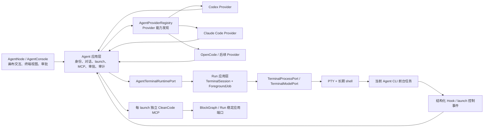

# Agent 终端底座与 Provider 扩展路线图

## 文档地位

本文记录 cleancode Agent 从 Codex 专用 PTY 演进为“稳定画布 Agent + 通用终端底座 + 可扩展 Provider”的已确认方向、实施阶段、阶段验收边界和完成证据。本路线的主体实现已经进入 `main`；主体架构已经落地，但必须取得 macOS、Linux 和 Windows 三个原生平台的 PTY 验收证据后才能宣告完成。当前事实仍以各 owner 文档为准。

本文是实施路线，不是当前能力清单。尚未完成的条目不得被表现层、测试或其他文档当作已经存在的产品行为。每个阶段进入生产实现前仍须按照[开发协作规范](../../engineering/development.md)完成 Large Change 的 Spec、必要的可行性检查、Plan 和 TDD；阶段完成后，已经成为当前事实的规则必须迁入对应 owner 文档。

本文不重新定义当前事实：

- 当前 Agent 身份、Provider 对话绑定、运行时和工作区生命周期以 [Agent 与会话生命周期](agent-session.md)为准。
- 当前 CleanCode MCP、审批、鉴权和审计以 [cleancode 原生 MCP](cleancode-mcp.md)为准。
- 当前普通终端 PTY、运行身份、权威模型和恢复以[终端会话生命周期](../run/terminal-session.md)为准。
- 当前跨上下文 owner 和协作关系以[架构文档](../../engineering/architecture.md)与[上下文地图](../../engineering/context-map.md)为准。
- 用户当前能够依赖的 Agent 交互与视觉语义以 [UI 契约](../../product/ui-contract.md)和 [UI Style Guide](../../product/ui-style-guide.md)为准。

路线图不设置精确交付日期。状态只表达阶段是否尚未开始、实施中或已经完成。

## 已确认产品方向

以下方向已经由产品决策确认，后续阶段不得重新解释为其他产品模型：

1. cleancode 只复用“Agent CLI 运行在终端之上”的技术底座，不引入标签页、Agent 切换或其他工作台产品结构。
2. Agent 继续是 cleancode 画布中的稳定对象，不是普通终端积木，也不加入终端组合、端口治理或终端依赖工作流。
3. 新建 Agent 主动作使用应用级默认 Provider；用户通过相邻菜单或 Agent 设置修改后续创建使用的默认值。Provider 在 Agent 创建后仍是不可变属性；需要使用另一个 Provider 时，新建另一个 Agent，不在既有 Agent 上切换 Provider。
4. 同一工作区可以同时存在多个相同或不同 Provider 的 Agent。每个 Agent 拥有独立终端、Agent CLI、输入输出、对话绑定、MCP 会话、审批和审计，但共享工作区目录。
5. Agent CLI 是长期终端中的受管前台任务。Agent CLI 正常退出或被中断退出后，底层终端继续运行并回到可输入 shell。
6. 没有终端文本选区时，`Ctrl+C` 必须以原始 `\x03` 输入交给当前前台程序；cleancode 不把它直接映射成关闭 Agent 或关闭终端。有选区时继续复制选中内容。
7. Provider 负责具体 CLI 的检测、启动、恢复、结构化生命周期事件和能力注入；Agent、Run、MCP、审批和通用 UI 不得为每个 Provider 增加条件分支。
8. 新增一个具备基础终端能力的 Agent，目标上只需要新增并注册一个 Provider contribution；恢复、精确活动状态、CleanCode MCP 和系统指令属于可选增强能力。

## 改造前背景与基线

改造开始前，Agent 已经具备以下有价值且必须保留的 cleancode 产品能力：

- 工作区内零个或多个稳定 Agent，拥有独立身份、名称和画布布局。
- 按项目、稳定物理工作区和 `agentId` 隔离的 Codex thread 绑定。
- 真实 Codex CLI PTY、独立输入输出和主题化 xterm 控制台。
- 每个 Agent 独立的 CleanCode MCP 开关、URL、Bearer Token、审批队列和审计。
- 对破坏性画布工具调用的 cleancode UI 审批、目标高亮和审批意图连线。
- 项目 checkout、工作区归档、Agent 删除和应用退出期间的生命周期 lease、迟到 attach 拒绝与资源排空。
- 多 Agent 共享工作目录但不伪装成文件级隔离的明确产品语义。

改造前实现的主要限制：

- 领域快照、值对象、应用层端口、运行时状态、基础设施适配器和 UI 可用性检查都直接使用 Codex 名称或 `codexThreadId`。
- Agent 基础设施直接启动 Codex 进程；Codex 退出等同于当前 Agent PTY 退出，终端不能作为继续使用的 shell 留存。
- Agent xterm surface 与 Run 的普通终端权威模型、sequence、snapshot 和 attach/detach 协议分离，重复承担终端基础设施职责。
- 新增 Claude Code、OpenCode 或其他 Agent 会迫使核心流程出现 Provider 条件分支，不能形成稳定扩展边界。

Run 当前已经具备可复用的技术基础：

- 精确的 `sessionId + runId + generation` 运行身份与迟到事件隔离。
- PTY、权威终端模型、单调输出 sequence、有界 snapshot 和可丢弃视图。
- 交互式启动命令被 `Ctrl+C` 中断或自然结束后回到同一个可输入 shell 的语义。
- 工作区、项目、应用退出和 Provider 恢复期间的串行生命周期与资源清理。

本路线在这些基础上建立 Agent 专用的终端 owner 和受管前台任务，不另建第二套通用终端运行时。

## 范围

路线覆盖：

- 稳定工作区 Agent 与易失终端、Agent launch、Provider session 的身份拆分。
- 固定 Provider 的 Agent 创建、持久化、分支对话绑定和恢复。
- Agent 通过应用层端口复用 Run 的 PTY、终端模型、视图和恢复能力。
- Agent CLI 作为终端前台任务的启动、退出、重新启动、中断和资源清理。
- Codex 从专用 PTY 迁移到通用终端底座。
- Claude Code 作为第二个完整 Provider 的接入。
- OpenCode 第三 Provider、后续最小接入契约和可选能力降级。
- CleanCode MCP、审批、审计和画布刷新在多 Provider 下的安全注入。
- 对应的 unit、integration、contract、E2E 和运行风险验证。

## 非目标

本路线不包含：

- 在已经创建的 Agent 上切换 Provider。
- 把 Agent 改造成普通 TerminalBlock、加入终端组合或参与普通终端工作流。
- 引入标签页、会话列表、Agent 切换器或其他不属于 cleancode 画布模型的产品信息架构。
- 动态插件市场、第三方 Provider 包安装、签名、来源信任或卸载迁移。
- 复制、解析或持久化 Provider 的对话正文。
- 通过扫描历史目录、最近会话或终端输出猜测 Provider session ID。
- 让 capability 不足的 Provider 假装支持恢复、精确状态或 CleanCode MCP。
- 第一版允许 Agent terminal 在应用退出后继续运行。
- 用 Provider 原生预批准替代 cleancode 对破坏性画布动作的独立审批。

## 统一语言

| 术语                 | 含义                                                                                                           |
| -------------------- | -------------------------------------------------------------------------------------------------------------- |
| 工作区 Agent         | 画布中的稳定业务对象，拥有身份、固定 Provider、名称、布局、MCP 偏好和分支对话绑定                              |
| Agent Provider       | 一个 CLI Agent 的能力贡献，负责检测、启动、恢复、遥测和能力注入                                                |
| Agent terminal       | 由 Run 承载、归属于一个工作区 Agent 的长期 shell/PTY，不是普通终端积木                                         |
| Agent launch         | Agent terminal 内一次具体的 Agent CLI 前台任务，拥有独立 `launchId + generation`                               |
| Provider session ref | Provider 正式报告、用于恢复其对话的版本化引用，例如 Codex thread UUID、Claude session ID 或 OpenCode `ses_` ID |
| Agent activity       | Provider 结构化事件归一化后的 `idle`、`working`、`waiting_input` 或 `waiting_approval` 等活动状态              |
| 基础终端能力         | 启动、输入、输出、resize、`Ctrl+C` 和 CLI 退出后回到 shell，不要求 Provider 支持额外协议                       |
| Provider 增强能力    | 对话恢复、精确活动状态、CleanCode MCP、系统指令或安装诊断等可选能力                                            |
| 终端退出             | shell/PTY 已结束，整个 Agent terminal 不再接受输入                                                             |
| Agent 退出           | 当前 Agent launch 已结束，但 Agent terminal 仍然运行并可接受 shell 输入                                        |

## 全程不变量

所有阶段都必须保持以下不变量：

1. 工作区 Agent 的稳定身份、固定 Provider、名称、布局、MCP 偏好和对话绑定始终由 Agent 上下文拥有。
2. Agent terminal 的 PTY、运行身份、权威屏幕模型、输出 sequence 和视图协议始终由 Run 上下文拥有。
3. `providerId` 在 Agent 创建后不可修改；通用领域、应用、IPC 和 UI 不提供切换 Provider 的动作。
4. 同一工作区可以同时运行多个不同 Provider 的 Agent；每个 Agent 的终端、launch、MCP、审批、审计和对话绑定必须独立。
5. Agent CLI 退出不得删除工作区 Agent，也不得自动终止底层 Agent terminal。
6. 终端有选区时 `Ctrl/Cmd+C` 复制；无选区时 `Ctrl+C` 只发送原始 `\x03`，不直接调用关闭或停止用例。
7. Agent 活动状态与终端运行状态是两个独立维度，任何一方不得代替另一方的事实来源。
8. Provider session ref 只能来自 Provider 的正式结构化通知、Hook 或明确启动结果，不能靠文件扫描或输出猜测。
9. Provider Hook、MCP 请求、前台任务退出和终端事件必须匹配当前 `agentId + terminal identity + launchId + generation`；迟到事件不得污染新 launch。
10. MCP URL、Token、临时配置、待审批请求和进行中调用都是 Agent launch 的易失事实，不写入稳定 Agent 仓储。
11. Provider 原生权限配置最多预批准当前 Agent 的 CleanCode MCP 工具，不得扩大 Shell、文件、Git、网络或其他 MCP 的权限。
12. 所有破坏性画布工具继续进入 cleancode 领域策略、UI 审批和审计，不依赖 Provider 是否提示审批。
13. Agent 不获得普通终端积木的组合、端口、连接、批量运行或工作流动作。
14. Project 的物理工作区归档和删除生命周期继续通过稳定端口协调 Agent；默认工作区 checkout 保留同一 Agent 运行态。Agent 再通过自己的终端端口使用 Run，不形成 Run 到 Agent 的反向依赖。
15. 新增 Provider 不得要求修改 Agent domain、Run domain、通用 Agent IPC 或通用 AgentConsole 的控制流。

## 目标架构



### 上下文职责

| Owner        | 拥有                                                                                        | 不拥有                                                         |
| ------------ | ------------------------------------------------------------------------------------------- | -------------------------------------------------------------- |
| Agent        | 工作区 Agent、Provider、对话绑定、Agent launch、活动状态、MCP、审批、审计                   | PTY 实现、ANSI 模型、BlockGraph 内部模型                       |
| Run          | Agent terminal、PTY、shell、前台任务技术生命周期、输入输出、resize、snapshot、attach/detach | Provider session、Agent 活动语义、MCP 审批                     |
| Project      | 项目、稳定工作区、Git 分支元数据和 checkout/归档事务                                        | Agent 或 Run 内部运行状态                                      |
| BlockGraph   | 终端积木、组合、连接、布局和执行意图                                                        | Agent terminal 和 Provider                                     |
| Presentation | 画布投影、xterm 视图、创建 Agent 交互、状态反馈和审批交互                                   | 稳定 Agent、PTY、Provider session 或审批结果的权威状态         |
| Platform     | Electron IPC 注册、进程入口和依赖装配                                                       | Provider 分支业务规则、Agent 生命周期规则或 Run 的终端模型实现 |

### 依赖方向

```txt
Agent application
  ↓ AgentTerminalRuntimePort
Agent infrastructure adapter
  ↓
Run application use cases

Agent application
  ↓ AgentProviderRegistryPort
Agent infrastructure Provider contributions
```

Run 不导入 Agent 聚合、Provider descriptor 或 MCP 类型。Agent 不直接访问 Run 聚合、Provider socket、PTY map 或终端恢复文件。

## 目标状态模型

### 稳定 Agent

目标持久化模型表达固定 Provider 和 Provider 中立的对话引用：

```ts
interface PersistedWorkspaceAgentSnapshot {
  readonly agentId: string
  readonly projectId: string
  readonly workspaceId: string
  readonly providerId: string
  readonly name: string
  readonly layout: AgentLayoutSnapshot
  readonly cleancodeMcpEnabled: boolean
  readonly providerSessionRef: ProviderSessionRef | null
}

interface ProviderSessionRef {
  readonly formatVersion: number
  readonly kind: string
  readonly value: string
  readonly metadata?: Readonly<Record<string, unknown>>
}
```

`providerId` 和单一 `providerSessionRef` 属于稳定工作区 Agent。对话作用域使用 `projectId + workspaceId + agentId`；Git 分支和目录只是 launch 元数据。仓储和 Provider driver 必须校验 session ref 与当前 Agent Provider 一致。

### 易失运行时

```ts
interface AgentRuntimeSnapshot {
  readonly agentId: string
  readonly providerId: string
  readonly terminal: {
    readonly sessionId: string
    readonly runId: string
    readonly generation: number
    readonly status: 'starting' | 'running' | 'historical' | 'exited' | 'failed'
  }
  readonly launch: {
    readonly launchId: string
    readonly generation: number
    readonly status: 'not_started' | 'launching' | 'running' | 'stopped' | 'failed'
    readonly exitCode: number | null
  }
  readonly activity: {
    readonly status: 'unavailable' | 'idle' | 'working' | 'waiting_input' | 'waiting_approval'
  }
}
```

终端状态、前台任务状态和 Agent 活动状态必须分别投影。Provider 没有结构化遥测时，activity 使用 `unavailable`，不得从普通输出频率推断 `working`。

### Run 终端 owner

Run 的终端槽位需要从固定 `blockId` 演进为类型化 owner：

```ts
type TerminalOwnerRef =
  { readonly kind: 'block'; readonly id: string } | { readonly kind: 'agent'; readonly id: string }
```

`owner.kind` 必须进入终端 slot key、清理谓词、恢复身份和 IPC 校验。只有 block owner 可以参与 BlockGraph 工作流和端口治理；只有 Agent 应用层可以请求 agent owner。

## Provider contribution 契约

Provider 使用可组合的小接口，不建立包含全部可选行为的巨大 driver：

```ts
interface AgentProviderContribution {
  readonly descriptor: AgentProviderDescriptor
  readonly detector: AgentProviderDetector
  readonly launcher: AgentLaunchPlanner
  readonly resume?: AgentResumeStrategy
  readonly sessionRefCodec?: AgentProviderSessionRefCodec
  readonly telemetry?: AgentTelemetryContribution
  readonly cleancodeCapability?: AgentCapabilityInjector
}
```

基础 descriptor 至少声明：

```ts
interface AgentProviderDescriptor {
  readonly id: string
  readonly displayName: string
  readonly capabilities: {
    readonly sessionRefCodec: boolean
    readonly resume: boolean
    readonly sessionIdentityCapture: boolean
    readonly activityTracking: boolean
    readonly launchInstructions: boolean
    readonly cleancodeMcp: boolean
  }
}
```

启动计划必须是经过 Provider 校验的结构化数据：

```ts
interface AgentLaunchPlan {
  readonly executable: string
  readonly args: readonly string[]
  readonly env: Readonly<Record<string, string>>
}
```

launch 前由应用层创建 `AgentLaunchArtifactScope` 并通过 command 中的 registrar 交给 contribution；Provider 创建的 reporter、临时文件和其他资源必须立即登记。计划建立后 scope 封口，替换、退出或失败时由同一 scope 逆序清理和重试，不再由 launch plan 携带可被遗漏的临时资源数组。

通用层不得把用户文本或 session ID 拼接为未经转义的 shell 命令。内建 Provider 应优先使用解析后的可执行文件和 argv；必须经过 shell 的部分由 Run 的平台相关编码器处理。

### 能力分级

| 能力           | 最低 Provider 要求                              | 通用 UI 行为                                                                               |
| -------------- | ----------------------------------------------- | ------------------------------------------------------------------------------------------ |
| 基础终端       | descriptor、detector、launcher                  | 可以创建、输入、输出、resize、中断和在 CLI 退出后使用 shell                                |
| 对话引用       | session-ref codec 与正式身份捕获                | 只持久化经过当前 Provider 校验的当前作用域引用                                             |
| 对话恢复       | resume 与已持久化 Provider session ref          | “重新启动 Agent”恢复当前分支对话                                                           |
| 精确活动状态   | telemetry 声明 activity signal 并提供结构化事件 | 展示 working、waiting、approval、idle；不支持时不得从输出频率猜测                          |
| 支持 MCP       | 会话级 capability injector                      | 开关可用；MCP readiness 独立展示，初始化或失败不阻断基础 terminal/launch                   |
| 不支持 MCP     | 无 capability injector                          | 不注册端点、不注入配置，隐藏 MCP 开关                                                      |
| 画布语义指令   | launch instructions 与 capability injector      | MCP 开启时注入画布语义，不替换 Provider 默认安全和工具指导                                 |
| 安装与版本诊断 | detector 返回结构化 availability                | 区分 installed、missing、upgrade_required 和 temporarily_unavailable；只比较声明的最低版本 |

创建 Agent 的 Provider 列表、能力开关和错误展示必须从 registry/descriptor 投影。Presentation 不维护 Provider switch。

### 新增 Provider 的完成标准

增加 OpenCode 或其他 Provider 时，允许的公共改动仅包括：

- 在 composition root 注册 contribution。
- 增加 Provider 图标、名称和安装提示等资源。
- 把 Provider 加入共享 contract 测试数据。

如果接入 Provider 需要修改 Agent domain、Run domain、通用 Agent IPC、通用 AgentConsole 控制流、MCP 工具实现或审批模型，则 Provider 边界尚未稳定，不能把该 Provider 宣告为完成。

## Ctrl+C、前台任务与终端退出语义

### 输入规则

Agent 控制台与普通终端共用以下稳定规则：

1. 终端存在文本选区时，`Ctrl/Cmd+C` 复制选区并阻止该按键进入 PTY。
2. 没有文本选区时，`Ctrl+C` 由 xterm 产生原始 `\x03` 并通过 Agent terminal 输入端口写入 PTY。
3. cleancode 不根据 Provider 类型拦截或改写 `\x03`，也不直接调用停止 Agent、停止终端或删除 Agent 的用例。
4. Agent TUI 处于 raw mode 时可以自行把 `\x03` 解释为取消 turn、关闭弹层或退出；shell/普通命令处于前台时遵守终端和信号的原生语义。
5. Provider Hook 只观察活动状态，不拥有键盘控制字符语义。

### 前台任务规则

Agent terminal 先建立长期 shell，再启动 Agent CLI 前台任务。Run 必须提供前台任务开始和退出的权威技术事件，不能通过提示符文本或 Provider 输出猜测：

```txt
Create Agent terminal
  ↓
Confirm the owned terminal is running
  ↓
Launch Provider CLI with launchId + generation and wait for started evidence
  ↓
Forward raw terminal input
  ↓
Provider CLI exits
  ↓
Emit authoritative foreground-job exit
  ↓
Keep terminal running and return to shell
```

Run 生成的前台任务 started/exit 控制事件必须带当前运行身份和随机 Token，并在进入用户可读终端模型前被消费；不得让控制帧污染 transcript、scrollback 或 Agent 对话。

### 退出动作

| 动作                     | Agent launch  | Agent terminal  | 稳定 Agent | 对话绑定               |
| ------------------------ | ------------- | --------------- | ---------- | ---------------------- |
| `Ctrl+C` 取消当前 turn   | Provider 决定 | 保留            | 保留       | 保留                   |
| Agent CLI 自然退出       | 结束          | 保留并回到shell | 保留       | 保留                   |
| 重新启动 Agent           | 新 generation | 复用终端        | 保留       | 支持时恢复             |
| 新对话                   | 替换          | 复用终端        | 保留       | 清除单一引用后重新绑定 |
| 关闭 CleanCode MCP       | 替换          | 复用终端        | 保存偏好   | 支持时继续原对话       |
| 删除 Agent               | 结束          | 终止并清理      | 删除       | 删除单一引用           |
| 默认工作区 checkout      | 保留          | 保留            | 保留       | 保留                   |
| 归档物理工作区/移除项目  | 结束          | 按生命周期清理  | 按现有规则 | 按现有持久化规则       |
| 应用退出（本路线第一版） | 结束          | 终止            | 保留       | 保留                   |

## CleanCode MCP、审批与审计

CleanCode MCP 继续由 Agent 上下文拥有，Provider 只负责把当前 launch 的能力安全注入 CLI。

每次 Agent launch 的顺序：

1. 重新校验项目、稳定 `workspaceId`、物理目录、Agent 身份和 Provider 可用性；分支只作为 launch 元数据。
2. 如果 Agent 启用 CleanCode MCP，创建本 launch 独立的 URL、Bearer Token 和审批作用域。
3. Provider capability injector 生成仅作用于本次进程的 MCP 配置和追加指令。
4. 启动 Agent CLI；Provider launch 启动后独立进入 running，MCP 继续等待当前 registration 完成认证 `initialize` 与 `notifications/initialized` 握手。
5. MCP 注册失败时独立投影 `failed`；Provider started 后等待 30 秒仍未完成握手时投影 `degraded`，保留当前 registration 供迟到握手恢复；两者都保留基础 terminal/launch，并只在 MCP 控件提供状态与重连动作，不因被动启动状态发送应用通知。
6. Agent CLI 退出时立即关闭新调用准入、取消等待审批、排空已准入调用、注销端点并清理临时配置；Agent terminal 继续运行。

Provider 的预批准范围只能匹配当前 `cleancode` Server。即使 Provider 已预批准，删除积木、解散组合和断开依赖仍由 cleancode 自己的审批策略决定。

Provider 不支持安全的会话级 MCP 注入时，Agent 仍可使用基础终端能力，但 UI 不提供 CleanCode MCP 开关；不得先注册端点再静默降级。

## 工作区和应用生命周期

### 物理工作区生命周期与 Git checkout

Project 只在物理工作区归档、移除或目录重绑定时通过 Agent 生命周期端口协调工作目录：

1. 安装阻止迟到 attach/launch 的 lifecycle lease。
2. 等待在途 Agent attach 和 launch 收束。
3. Agent 关闭目标目录全部 launch 的 MCP 与审批准入。
4. Agent 通过 `AgentTerminalRuntimePort` 停止并清理对应 Agent terminal。
5. Project 执行归档、删除或目录重绑定并提交持久化状态。
6. 失败时按稳定 Provider session ref 恢复原物理工作区 Agent。
7. 只有外部事实和持久化事实收束后才能 release、resolve 或 quarantine lease。

Run 不直接读取 Agent 仓储；Agent 不绕过 Project 的生命周期事务直接决定分支归属。

默认工作区的普通 Git checkout 不安装 lifecycle lease，不停止 Agent terminal，也不替换 Provider session ref；成功后只更新分支启动与显示元数据。

### 应用退出与恢复

第一版保持当前 Agent 退出策略：应用退出时停止 Agent launch、清理 MCP/审批并终止 Agent terminal；下次打开应用时通过 Provider session ref 恢复对话。

Run 已支持部分普通终端跨应用保留，但 Agent terminal 还依赖易失 MCP Token、审批队列、Hook endpoint 和 launch generation。在这些事实能够安全重新建立之前，不启用 Agent terminal 的 `keep-after-application-exit`。

跨应用保留 Agent terminal 若进入未来范围，必须作为独立 Large Change 重新确认安全模型，不是本路线的隐含结果。

## 平台支持与完成边界

本路线的基础终端能力必须支持 macOS、Linux 和 Windows，不允许把 Windows 作为已知不支持边界：

| 平台    | 终端底座                     | Agent 前台任务控制                          | 原生验收要求                                                    |
| ------- | ---------------------------- | ------------------------------------------- | --------------------------------------------------------------- |
| macOS   | node-pty + POSIX PTY         | mode `0700` 子脚本、结构化 argv/environment | `Ctrl+C`、退出码、重复 launch、外层 shell 可写                  |
| Linux   | node-pty + POSIX PTY         | 与 macOS 相同                               | 与 macOS 对等，且不能依赖 Darwin 专有行为                       |
| Windows | node-pty + ConPTY/PowerShell | Base64 参数的临时 `.ps1` 和随机控制帧       | npm `.cmd` 检测、`Ctrl+C`、退出码、重复 launch、PowerShell 可写 |

Windows 最低运行边界是 node-pty 当前要求的 Windows 10 1809 或更高版本。普通 Windows terminal 可以使用 `cmd.exe`，但 Agent terminal 固定由 PowerShell/PowerShell Core 承载，以获得安全的结构化参数调用和前台任务生命周期。

PowerShell 脚本文本 unit、伪造进程或其他平台上的 `win32` 条件模拟只能证明编码和契约，不能替代 Windows 原生 ConPTY 集成测试。三平台 runner 由 [Agent terminal platforms workflow](../../../.github/workflows/agent-terminal-platform.yml)维护；任一平台未执行或失败时，本路线状态必须保持“实施中”。

## 阶段总览

| 阶段 | 名称                            | 核心结果                                                             | 状态   |
| ---- | ------------------------------- | -------------------------------------------------------------------- | ------ |
| 0    | 当前行为证据                    | 用自动化测试锁定 Codex、Ctrl+C、MCP、多 Agent 和工作区生命周期基线   | 已完成 |
| 1    | Provider 中立领域与持久化       | 固定 Provider Agent、通用 session ref 和无损 schema 迁移             | 已完成 |
| 2    | Provider registry 与 Codex 封装 | 核心流程依赖通用 contribution，Codex 行为暂时不变                    | 已完成 |
| 3    | Agent terminal 与前台任务       | Run 支持 agent owner、长期 shell 和可重复 Agent launch               | 实施中 |
| 4    | Codex 迁移与行为对等            | Codex 使用 Run 终端底座，CLI 退出后终端继续运行                      | 实施中 |
| 5    | 终端视图、IPC 与创建体验统一    | Agent 复用 Run 视图协议，创建时固定使用当前默认 Provider             | 已完成 |
| 6    | Claude Code 完整 Provider       | 同工作区可同时运行 Codex 与 Claude Code                              | 已完成 |
| 7    | Provider 扩展契约稳定化         | OpenCode 完整 contribution 与后续最小 Provider contract 同时验证边界 | 实施中 |

阶段按顺序建立边界。阶段 1 和 2 不得提前改变用户可见运行语义；阶段 3 必须先证明终端/前台任务边界，再迁移 Codex；Claude Code 不得在 Codex 行为对等之前进入主路径。

## 完成结果

- 稳定 Agent 已持久化不可变 `providerId` 和单一版本化 `ProviderSessionRef`；schema v5 只接受当前格式，不迁移旧 Codex UUID 或分支绑定。
- `AgentProviderRegistry` 只组合 descriptor、detector、launcher、fresh session、session-ref codec、resume、telemetry 和 capability injector，并校验 capability 与实际 contribution 一致；通用 Agent service、IPC 和 UI 不按 Provider ID 分支。
- Agent terminal 已成为 Run 的 `agent` owner，会话内的 Agent CLI 是可重复启动的 `ForegroundJob`。macOS/Linux 使用 POSIX 控制脚本，Windows 使用 ConPTY/PowerShell 控制脚本；CLI 退出只结束本次 launch，shell、终端模型和视图继续存在。
- Agent Console 已删除独立 xterm registry、输出尾部缓存和原始输出 IPC，复用 Run 的 snapshot、sequence、attach/detach 与共享 xterm surface。
- 创建 Agent 时从 registry 当前可用项解析默认 Provider；默认值只影响后续新建，既有 Agent 没有切换入口，主进程也拒绝与持久化 Provider 不一致的 attach。
- Codex、Claude Code 和 OpenCode 专用 contribution 已注册。Codex 提供 thread 身份与恢复、MCP 和 launch instructions，但不声明精确活动跟踪；Claude Code 提供首次用户输入确认的 session 绑定、恢复、Hook 活动和 MCP；OpenCode 提供 `opencode-session` codec、`--session` 恢复、顶层 session/活动插件事件、合并用户 inline config 的远程 MCP 与临时 instructions。Gemini 复用声明式 terminal CLI contribution，以正式 `--session-id` 预分配 UUID、在 launch 启动后确认绑定、用 `--resume` 恢复，并通过临时 system settings 注入 MCP。共享 contract fixture 同时证明最小 Provider 可以诚实降级，以及不带 telemetry 的 client-assigned session contribution 可以进入通用契约。
- CLI availability 已区分 installed、missing、upgrade_required 与 temporarily_unavailable；当前只有 Claude Code 声明 `2.1.119` 最低版本，Codex 与 OpenCode 不制造最低版本门槛。
- terminal、launch、activity、MCP readiness 与 Provider-session binding 已独立投影。MCP 初始化、失败或超时不终止基础 launch；binding 保存失败只标记 `persistence_failed`，不会覆盖仍在运行的 launch/activity。
- Provider launch callback 由 Agent session 与单调 launch generation 双重隔离；临时资源通过每次 launch 的 `AgentLaunchArtifactScope` 登记，并在替换、退出与生命周期清理时释放或保留失败 scope 供重试。
- Terminal Provider 协议 v4 把前台任务请求和 started/exited 事件送入独立 Provider 进程；`awaiting_started` 阶段消费内部 shell transport 回显，Agent 屏幕只从 Provider started 后发布输出；当前 macOS 真实 Electron E2E 已证明 `Ctrl+C` 结束 Codex launch 后同一 shell 继续接受命令，Windows 由原生 ConPTY integration 门禁负责对等验收。

后续增加 Agent CLI 的标准步骤是：基础 Provider 在 catalog 增加数据项；只有正式 session 参数和 MCP 配置差异时，组合声明式 session 与 launch-scoped injector；需要 Hook、插件、结构化 reporter 或特殊握手时，才在 `src/contexts/agent/infrastructure/providers/<provider>/` 实现专用 contribution。每种新增能力都要增加 provider contract、参数和清理测试。只有展示名称、安装命令或图标等资源可以作为伴随改动；若必须修改 Agent domain、Run domain、通用 IPC 或 `AgentConsole` 控制流，应先修正 Provider 边界，而不是增加中央分支。

## 当前验证证据

2026-07-22 在 `feature/agent-terminal-providers` 分支完成以下 macOS 本机验证；这些是当时的基线证据，不替代后续远端三平台门禁：

- 全部依赖、文档、行数、日志、主题、国际化、格式、Lint、TypeScript、依赖方向、未使用代码和 diff 门禁通过。
- Unit：179 个测试文件、826 项测试通过。
- Integration：28 个测试文件、134 项测试通过；另有 2 个 Windows 原生测试文件、2 项测试因当前为 macOS 而按平台跳过。
- Contract：11 个测试文件、68 项测试通过。
- Electron E2E：11 个测试文件、43 项测试通过；其中包含多 Agent、固定 Provider 创建、Claude 空会话与首次输入后的恢复边界、画布取消选择时的 xterm 视觉稳定、`Ctrl+C` 后回到同一 shell、跨工作区主题/进程复用、普通终端、恢复、工作流、端口和 worktree 回归。
- `pnpm build` 成功生成 Electron main、Terminal Provider、preload 和 renderer 产物。
- 2026-08-31，`main` 的最近一次全平台质量 workflow 已在 macOS、Linux 和 Windows 完整成功；同批 Electron E2E 的 macOS 与 Linux 已通过，Windows shard 2 在 `terminal-runtime-recovery.e2e.spec.ts` 的“Electron main 崩溃后 warm attach 保留会话”场景等待重连超时。因此阶段 3、4、7 和全路线继续保持“实施中”；当前阻塞是最近一次 E2E 汇总尚未全绿，不再是 Windows/Linux runner 从未执行。

## 阶段 0：当前行为证据

状态：已完成。

### 阶段目标

在结构改造前建立可复用的行为证据，区分必须保持的 cleancode 特色与明确需要改变的 Codex 专用限制。

### TDD 与验证计划

- Unit：有选区复制、无选区 `Ctrl+C` 进入 Agent 输入端口、Agent 控制台选择与终端输入隔离。
- Unit：多 Agent 的 session、MCP、审批和稳定工作区绑定互不污染。
- Integration：现有 Codex PTY 启动参数、thread reporter、MCP/default approval 和清理顺序。
- Integration：Run interactive launch 在 `Ctrl+C` 和命令自然结束后继续接受 shell 输入。
- Contract：Agent IPC 的 attach、write、resize、restart、MCP 重配和退出事件基线。
- E2E：多 Agent、工作区往返、主题、终端选择复制、审批和新对话主路径。

### 阶段验收

1. 所有已确认不变量都有自动化测试或明确的后续测试落点。
2. 测试能区分“Agent CLI 退出”和“终端退出”，即使当前实现尚未支持前者保留终端。
3. 后续阶段可以用同一组对等测试判断是否破坏 cleancode 特色。

### 阶段退出条件

- 基线测试在未修改生产实现时通过。
- 已记录当前已知限制，不能把限制误写成目标行为。

## 阶段 1：Provider 中立领域与持久化

状态：已完成。

### 阶段目标

让稳定 Agent 模型表达固定 Provider 和 Provider 中立的恢复引用，同时保持现有 Codex 用户行为不变。

### 计划能力

- 将稳定聚合语义从“Codex session”收敛为“WorkspaceAgent”；是否同步重命名文件和类由阶段 Plan 根据迁移风险决定。
- 引入 `AgentProviderId` 和版本化 `ProviderSessionRef`。
- Agent 创建命令要求一个 Provider；旧入口和旧数据确定性使用 `codex`。
- `providerId` 创建后不可修改，不新增 update/switch 用例。
- Agent 绑定按 `projectId + workspaceId + agentId` 隔离，每个 Agent 只保留一个 Provider session ref。
- 仓储使用 schema v5；产品未公开期间不迁移旧 `codexThreadId` 或旧分支绑定。
- 未知 Provider、未知 session ref 版本或畸形值必须拒绝恢复，不得回退到其他 Provider 或最近会话。

### TDD 与验证计划

- Unit：Provider 不变量、稳定工作区绑定、创建多个不同 Provider Agent、无切换入口。
- Integration：schema v5 严格读取、单一 session ref、原子写入和旧/损坏版本拒绝。
- Contract：创建/list Agent DTO 增加 Provider 后的向前一致性。

### 阶段验收

1. 所有既有 Agent 迁移后均为 Codex Provider，名称、布局、MCP 开关和 thread UUID 不变。
2. 一个 Agent 不能通过领域方法、用例或 IPC 修改 Provider。
3. 仓储可以持久化不同 Provider 的多个 Agent，但运行时仍只启用 Codex。

### 阶段退出条件

- migration、domain 和 contract 测试通过。
- UI 和 Codex 启动行为未改变。
- 回滚和损坏恢复策略已经在该阶段 Spec 中明确，不依赖手工修复用户 JSON。

## 阶段 2：Provider registry 与 Codex 封装

状态：已完成。

### 阶段目标

移除 Agent 应用层和通用 UI 对 Codex 进程细节的直接依赖，建立最小、可组合、能力驱动的 Provider 接口。

### 计划能力

- 建立 Provider registry、descriptor、detector、launch planner、resume、telemetry 和 capability injector 小接口。
- 用 Codex contribution 包装现有 CLI 检测、启动参数、resume、thread reporter 和 MCP 注入。
- Agent 应用层只按 `providerId` 解析 contribution，不包含 `if codex`、`if claude` 等分支。
- Provider availability 使用通用 DTO；Provider 专属安装建议由 descriptor/diagnostic 提供。
- 建立共享 Provider contract test suite。

### TDD 与验证计划

- Unit：registry 注册冲突、未知 Provider、capability 投影和不可用诊断。
- Contract：所有 Provider 必须满足 descriptor、检测和结构化启动计划契约。
- Integration：Codex contribution 生成与旧适配器相同的 resume、MCP、指令和 notify 参数。
- E2E：Codex Agent 的创建、启动、MCP、审批和新对话无用户可见变化。

### 阶段验收

1. Agent application 不再依赖 Codex 专用进程端口或 DTO。
2. 通用 UI 不再读取 `CodexCliState`，而是按当前 Agent `providerId` 读取 availability。
3. Codex 仍使用原专用 PTY，作为阶段 3/4 之前的兼容适配器。

### 阶段退出条件

- Codex 行为对等测试通过。
- Provider registry 没有形成新的巨大接口、中央 switch 或共享杂物目录。

## 阶段 3：Agent terminal 与前台任务

状态：实施中。生产实现与三平台原生质量门禁已完成；当前 `main` 的最新三平台 E2E 汇总尚未全绿。

### 阶段目标

在 Run 中建立可由 Agent 安全消费的终端 owner 和可重复前台任务，使 Agent CLI 生命周期不再等同于 PTY 生命周期。

### 计划能力

- `TerminalRunOwner` 引入 `block | agent` 类型化 owner，并把类型纳入 slot、事件、恢复和清理身份。
- Agent application 定义 `AgentTerminalRuntimePort`；基础设施适配器只调用 Run 公开用例。
- Run 建立 `ForegroundJob` 技术模型，区分 `onForegroundJobExit` 和 `onTerminalExit`。
- Agent terminal 先启动长期 shell，再通过带随机 Token 的前台任务控制脚本启动 Provider CLI，并以 started 事件确认 launch。
- CLI 退出后回到同一 shell；新的 launch 使用新 `launchId + generation`。
- Run 生成并消费带 Token 的控制事件，不扫描 Provider TUI 文本或普通 shell prompt。
- `Ctrl+C` 继续沿原始输入通道进入当前前台程序。
- 删除 Agent、物理工作区归档/移除和项目移除可以按 agent owner 精确清理终端、模型、订阅和恢复资料；默认工作区 checkout 保留它们。

### TDD 与验证计划

- Unit：typed owner slot、身份匹配、旧 generation 拒绝、幂等清理和 block/agent 能力隔离。
- Unit：前台任务状态机、重复 launch、退出与终端退出分离。
- Integration：真实 shell 中启动长任务，`Ctrl+C` 后回到同一 shell 并继续输入。
- Integration：Agent CLI 模拟程序自然退出后终端仍运行，可启动第二个前台任务。
- Integration：控制事件不进入终端 transcript、snapshot 或滚动历史。
- Contract：Run/Agent terminal port、foreground event 和完整身份字段。
- E2E：真实 Electron、node-pty、xterm 下的 Agent terminal 创建、中断、CLI 退出和重新启动。

### 阶段验收

1. Agent 前台任务退出不会触发 `TerminalSession` 退出。
2. 同一 Agent terminal 可以顺序运行至少两个 launch，旧 launch 事件不影响新 launch。
3. `Ctrl+C` 能中断模拟前台任务，随后 shell 继续接受输入。
4. Agent owner 不能进入工作流、端口租约、终端组合或普通终端批量动作。
5. 所有进程、监听器、控制事件和模型缓冲都有明确清理与资源上限。

### 阶段退出条件

- Run 的普通终端和工作流回归全部通过。
- Agent terminal 仍未替换 Codex 主路径时，可以独立通过模拟 Provider 验证。
- 未发现新的 Agent ↔ Run 循环依赖。

## 阶段 4：Codex 迁移与行为对等

状态：实施中。生产实现、Windows Provider 检测和 ConPTY 原生质量验收已完成；当前 `main` 的最新三平台 E2E 汇总尚未全绿。

### 阶段目标

把 Codex 从直接 PTY 进程迁移为 Agent terminal 内的 Provider CLI 前台任务，并保持所有 cleancode 专属能力。

### 计划能力

- Agent attach 创建或复用 agent owner 的 Run terminal，再启动 Codex launch。
- Codex resume、thread reporter、`--no-alt-screen`、MCP/default approval 和 developer instructions 继续由 Codex contribution 生成。
- thread UUID 只绑定当前 `agentId + branch + launch generation`。
- Codex 自然退出或退出 TUI 后关闭 launch MCP/审批并回到 shell。
- “重新启动 Agent”在同一 terminal 启动新 Codex launch 并恢复当前分支 thread。
- “新对话”清除当前分支 thread，保持 Agent 和 terminal，启动新的 Codex launch。
- MCP 开关重配只替换 Codex launch 及其易失能力，不删除 Agent；是否复用同一 terminal 必须由前台任务验证结果决定，不能为了复用牺牲清理确定性。
- Codex 对等完成前保留旧适配器作为开发期回退；对等门禁完成后删除旧主路径。

### TDD 与验证计划

- Integration：Codex 新会话、resume、thread 回报、MCP Token、默认预批准和临时资源清理。
- Integration：Codex 退出后 shell 可输入，重新启动恢复原 thread。
- Unit：MCP 重配、new conversation、旧 launch callback 和 scope validation。
- Contract：Agent 退出事件与 Terminal 退出事件分离。
- E2E：现有多 Agent、审批、主题、工作区往返和新对话用例全部复用；新增 Codex 退出后 shell 与重新启动路径。

### 阶段验收

1. Codex 所有现有用户能力和样式保持不变。
2. 无选区 `Ctrl+C` 仍由 Codex TUI 原生处理；有选区仍复制。
3. Codex CLI 退出后 Agent 节点、terminal、xterm 屏幕和 Provider session ref 保留。
4. 删除 Agent、物理工作区归档/移除和应用退出仍能精确清理全部资源；默认工作区 checkout 保留运行态。
5. 旧 Codex PTY 主路径不再接收新会话。

### 阶段退出条件

- Codex 对等矩阵全部通过。
- 旧适配器删除前已有一次完整 `pnpm pre-commit`、构建和真实 Electron E2E 证据。
- 当前事实文档更新为终端底座语义，不保留竞争描述。

## 阶段 5：终端视图、IPC 与创建体验统一

状态：已完成。

### 阶段目标

让 Agent 复用 Run 的权威终端模型和视图协议，同时保留独立的 Agent 画布外观与动作语义；创建 Agent 时固定使用当前默认 Provider。

### 计划能力

- Agent terminal 使用 Run 的 snapshot、sequence、attach/detach、query ownership、scrollback 和主题转换。
- 删除独立 Agent xterm registry、截断输出恢复和 Codex 专用终端事件。
- AgentConsole 继续作为独立画布组件，不直接复用 TerminalNode 的组合、端口和工具栏。
- 新建 Agent 流程从 registry 获取可用 Provider；主动作直接使用当前默认项，相邻菜单只修改后续创建的默认值。
- 不显示“切换 Provider”；菜单保留重命名、重新启动、新对话、CleanCode MCP 和删除。
- 标题栏只增加低噪声 Provider 身份和必要状态，不把 Agent 控制台变成复杂状态面板。
- Provider 未安装、声明的最低版本不满足或 CLI 检查返回 `temporarily_unavailable` 时显示对应结构化反馈；MCP 与 binding 异常由独立 runtime 维度展示，不混入 availability。

### TDD 与验证计划

- Unit：默认 Provider 解析、分段创建按钮、固定 Provider、capability 降级和可访问名称。
- Unit：Agent terminal snapshot 恢复、sequence 去重、选区复制与方向导航。
- Contract：通用 Provider availability、Agent runtime 三层状态和终端视图身份。
- E2E：创建多个 Provider Agent、工作区往返、主题切换、小地图、移动缩放、输入焦点和删除隔离。

### 阶段验收

1. UI 不包含 Provider-specific 控制流。
2. Agent 保持现有画布节点、审批卡、布局锚点和紧凑视觉风格。
3. Agent 和普通终端共享终端技术协议但不共享产品动作。
4. 已创建 Agent 没有修改 Provider 的入口。

### 阶段退出条件

- 独立 Agent terminal 基础设施已经删除或只保留明确、短期的迁移兼容层。
- UI 契约和国际化文案在实现完成时同步更新。

## 阶段 6：Claude Code 完整 Provider

状态：已完成。

### 阶段目标

用第二个完整 Provider 证明扩展边界，同一工作区可以同时运行 Codex 与 Claude Code Agent。

### 计划能力

- Claude Code CLI、`2.1.119` 最低版本与可用性检测；更旧版本返回 `upgrade_required`，而不是伪装为已安装可用。
- 新会话启动与正式 session resume；空启动不持久化，首次用户输入 Hook 确认后才建立可恢复绑定。
- 通过 Provider 正式 Hook 获取 session ID、turn、工具、等待输入、等待审批和停止事件。
- Hook relay 使用 launch Token、完整 owner 和 generation 校验；Hook 只提供 Agent activity，不替代前台任务退出事实。
- 通过会话级临时配置注入 CleanCode MCP，不修改用户全局 Claude 配置。
- 只预批准 `mcp__cleancode__*`，不扩大其他工具权限。
- 追加 cleancode 画布语义，不替换 Claude 默认 system prompt、安全或工具指导。
- 不使用会屏蔽用户其他 MCP 的严格配置，除非未来有独立产品策略明确要求。
- MCP 连接通过 cleancode 认证初始化握手验证；注册或握手失败独立显示 capability unavailable，不覆盖仍在运行的 terminal/launch。

### TDD 与验证计划

- Provider contract：检测、启动、resume、临时配置、参数转义和能力声明。
- Integration：模拟 Hook 的鉴权、session ref、活动归一化、重复/乱序/迟到事件。
- Integration：Claude MCP 注入只作用于当前 launch，退出后 Token 和文件失效。
- E2E：同工作区 Codex 与 Claude 同时运行，输入输出、MCP、审批、对话和删除互不影响。

### 阶段验收

1. Claude Agent 的创建不修改 Codex Provider 或通用 Agent 运行流程。
2. Claude CLI 退出后回到自己的 shell，不影响同工作区其他 Agent。
3. Claude session 只绑定当前 Agent 和分支，不能被其他 Agent 复用。
4. CleanCode MCP 不可用时明确失败或降级，不伪装成已启用。
5. Codex 全量回归继续通过。

### 阶段退出条件

- 两个完整 Provider 共用同一套核心用例、Run terminal port、IPC 和 AgentConsole。
- Provider 差异全部收敛在 contribution 及其测试内。

## 阶段 7：Provider 扩展契约稳定化

状态：实施中。Provider 契约、Windows npm shim 和三平台基础终端质量门禁已完成；当前 `main` 的最新三平台 E2E 汇总尚未全绿。

### 阶段目标

以具备完整增强能力的 OpenCode 和共享最小 Provider fixture 同时验证扩展路径，形成以后新增 Provider 的稳定维护约束。

### 计划能力

- 建立 Provider 模板和共享 contract suite，但不建立动态插件加载器。
- 最小 Provider 只实现 descriptor、detector 和 launcher 即可获得基础终端能力。
- resume、telemetry、CleanCode MCP 和系统指令按 capability 独立启用。
- OpenCode 通过正式 session ID/`--session`、launch 级事件插件、inline config 合并和远程 MCP 验证完整增强组合，同时不得写用户工作区或全局配置。
- 通用 UI 自动根据 capability 展示、禁用或解释功能，不增加 Provider switch。
- Provider 注册冲突、capability/contribution 不一致、声明的最低版本不满足和 launch scope 清理具有统一诊断。
- 文档记录新增 Provider 的目录、注册、测试和安全检查清单。

### TDD 与验证计划

- Contract：最小 Provider、不支持恢复 Provider、不支持 MCP Provider，以及完整 OpenCode Provider 的共享行为。
- Integration：Provider CLI 退出、`Ctrl+C`、重新启动、错误启动和临时资源清理。
- Architecture：静态检查或评审规则保证核心层没有 Provider ID 条件分支。
- E2E：至少一个非 Codex/Claude Provider 完成创建、运行、退出到 shell 和删除主路径。

### 阶段验收

1. 新 Provider 的生产改动限制在 Provider 模块、composition 注册和必要资源。
2. 不修改 Agent domain、Run domain、通用 IPC、AgentConsole 控制流、MCP 工具和审批模型。
3. capability 不足时产品诚实降级，基础终端仍然可用。
4. Provider contract suite 能阻止 session 串用、未转义参数、迟到 Hook 和资源泄漏。

### 阶段退出条件

- OpenCode 通过完整 Provider 验收，最小 Provider fixture 通过诚实降级验收。
- 后续 Provider 可以沿模板独立开发和验证。
- 是否进入动态 Plugin Provider 另立 Spec，不在本路线内自动启动。

## 建议提交序列

为了保持每一步可回滚、可审查和可独立验证，实施时建议按以下变更集拆分：

1. 当前 Agent、Ctrl+C、MCP 和工作区生命周期特征测试。
2. Provider 中立领域模型、DTO 和持久化 migration。
3. Provider registry、共享 contract suite 和 Codex contribution。
4. Run typed terminal owner 与清理/恢复身份。
5. Run foreground job、started/exit 控制事件。
6. Codex 迁移到 Agent terminal，并完成行为对等。
7. Agent terminal 视图与 IPC 统一，删除重复 xterm 基础设施。
8. 创建 Agent 的固定 Provider 选择和 capability UI。
9. Claude Code contribution、Hook、resume 和 MCP。
10. OpenCode 完整 Provider 与等价最小 Provider fixture 验证。
11. 删除迁移兼容层，迁移已经实现的规则到当前事实文档。

任何变更集只要改变生产运行、schema、IPC、PTY 或跨上下文端口，都必须单独按 Large Change 完成 Spec、Plan、TDD 和完整门禁，不能因为路线图已经确认而跳过实施确认。

## 全路线验证矩阵

| 层级        | 证明内容                                                                                  |
| ----------- | ----------------------------------------------------------------------------------------- |
| Domain Unit | 固定 Provider、稳定工作区绑定、Provider session ref、Agent 删除和多 Agent 隔离            |
| App Unit    | attach/launch/restart/new conversation、MCP 重配、活动状态、迟到事件和生命周期 lease      |
| Run Unit    | typed owner、foreground job、generation、terminal/job 退出分离和幂等清理                  |
| Integration | 真实 PTY/shell、`Ctrl+C`、CLI 退出到 shell、重复 launch、Provider 参数、MCP、Hook 和迁移  |
| Contract    | Agent/Run 端口、Electron IPC、Provider contribution、状态事件和完整身份                   |
| E2E         | 多 Provider Agent、工作区往返、主题、审批、创建删除、退出到 shell、重新启动和共享目录提示 |
| Performance | 后台多 Agent 输出、前台输入延迟、模型数量、缓冲上限、Hook/MCP 队列和长时间运行资源稳定性  |
| Build       | Electron main/preload/renderer、Provider 临时资源与 node-pty 打包后的真实运行             |
| Platform    | macOS、Linux 和 Windows 原生 PTY/ConPTY 的 Provider 检测、`Ctrl+C` 与退出到 shell         |

每个阶段必须明确最低回归层级；只用 mock 证明 PTY、shell、Hook、MCP 或 Electron 生命周期不算完成。

## 最高风险与控制措施

| 风险                              | 控制措施                                                                           |
| --------------------------------- | ---------------------------------------------------------------------------------- |
| `Ctrl+C` 被误映射成关闭 Agent     | 保留 raw input 路径；选区复制单独判断；真实 PTY 集成和 E2E 验证                    |
| Agent CLI 退出误杀终端            | 独立 ForegroundJob 状态和退出事件；TerminalSession 只响应 shell/PTY 退出           |
| 旧 launch 事件污染新会话          | 全部 Hook、MCP、退出和输出携带并校验 launchId、generation 和 Token                 |
| Provider session 串用             | Provider 固定在 Agent；稳定工作区归属校验；禁止最近会话和跨 Agent 回退             |
| MCP 被静默禁用                    | 认证握手失败或超时时独立显示 unavailable，保留仍可用的 Provider launch             |
| Provider 预批准扩大用户权限       | 只允许匹配 cleancode Server；破坏性动作继续走 cleancode 审批                       |
| shell 命令注入或参数损坏          | 内建 Provider 使用结构化 executable/argv；平台编码集中在 Run；session ref 严格校验 |
| Agent 与 Run 形成循环依赖         | Agent 定义端口，外层适配器调用 Run 用例；Run 不导入 Agent 类型                     |
| 普通终端行为被 Agent owner 破坏   | typed owner capability gate；Run 普通终端和工作流全量回归                          |
| 数据迁移丢失 Codex thread         | 确定性 migration、原子写入、旧版本 fixture、UUID 保留断言和明确回滚策略            |
| 多 Agent 资源增长                 | PTY、模型、Hook、MCP、审批、临时文件和缓冲全部有界；长时间运行和批量清理测试       |
| UI 退化为通用终端或其他工作台克隆 | Agent 继续独立画布组件；UI 契约和样式回归；不引入标签页和 Provider 切换            |

## 发布与回退原则

- Provider 中立存储和 Codex contribution 先于终端主路径切换发布，降低一次性迁移范围。
- Codex 新旧运行路径在开发期可以使用内部 kill switch 对比，但不得成为长期用户设置或两套事实来源。
- 新终端路径只有在 Codex 对等矩阵通过后才成为默认；默认切换后不允许新旧路径同时拥有同一 Agent。
- schema migration 必须在阶段 Spec 中明确旧版本读取、原子提交、失败保留和回退策略。
- Claude Code 和后续 Provider 采用 capability gate；单个 Provider 失败不得降低 Codex 或其他 Agent 的可用性。
- 删除旧适配器、旧 IPC 和旧 Agent xterm 基础设施前，必须证明不存在生产入口、持久化引用和测试依赖。

## 文档迁移规则

路线阶段完成后，按事实 owner 更新文档：

- 稳定 Agent、Provider、对话绑定和 launch 语义迁入 [Agent 与会话生命周期](agent-session.md)。
- Agent terminal 的 Run owner、前台任务和终端退出语义迁入[终端会话生命周期](../run/terminal-session.md)。
- Provider MCP 注入、握手、审批和审计迁入 [cleancode 原生 MCP](cleancode-mcp.md)。
- 上下文 owner 和新端口协作迁入[架构文档](../../engineering/architecture.md)与[上下文地图](../../engineering/context-map.md)。
- 已实现的创建 Provider、状态反馈、Ctrl+C 和退出到 shell 行为迁入 [UI 契约](../../product/ui-contract.md)。
- Provider 标识、状态密度和新增组件视觉规则只在确有共享规范时迁入 [UI Style Guide](../../product/ui-style-guide.md)。

已经实现的阶段必须在本文标为“已完成”并附自动化证据摘要；已经成为当前事实的详细规则不得继续只留在路线图中。

## 全路线完成定义

满足以下条件时，本路线可以宣告完成：

1. Codex、Claude Code 和至少一个第三 Provider 共用同一套 Agent 核心用例、Run terminal port、IPC 和 AgentConsole。
2. 创建 Agent 时使用固定的默认 Provider，产品中不存在切换既有 Agent Provider 的入口。
3. 所有 Provider 的 CLI 退出后底层终端继续运行并可重新启动 Agent。
4. `Ctrl+C` 在有选区和无选区时分别保持复制与原始 PTY 中断语义。
5. 多 Provider Agent 可以在同一工作区并行运行，且终端、会话、MCP、审批、审计和事件完全隔离。
6. 新增最小 Provider 不修改 Agent domain、Run domain、通用 IPC 或通用 AgentConsole 控制流。
7. cleancode 的画布节点、布局锚点、审批投影、主题、小地图和多 Agent 产品特色保持稳定。
8. 旧 Codex 专用 PTY、Codex 专用通用状态和独立 Agent xterm 基础设施已经删除。
9. 所有已实现规则迁入对应当前事实文档，路线图不再承担现行业务契约。
10. unit、integration、contract、E2E、性能和构建门禁均有可复现证据，不存在已知的进程、监听器、Token、审批或终端模型泄漏。
11. macOS、Linux 和 Windows 原生 runner 都通过 Agent terminal 平台门禁；模拟平台分支不得替代原生 PTY/ConPTY 证据。
