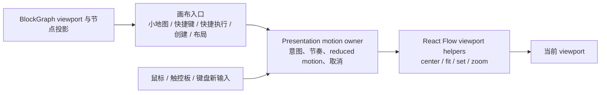

# 画布动效演进路线图

## 文档地位

本文记录 cleancode 画布相机与空间对象动效的已确认方向、阶段顺序和阶段验收边界。

本文是实施路线，不是当前能力清单。尚未完成的条目不得被表现层、测试或其他文档当作已经存在的产品行为。阶段完成后，已经稳定交付的用户行为迁入 [UI 契约](ui-contract.md)，共享动效规则和节奏迁入 [UI Style Guide](ui-style-guide.md)。

本文不重新定义当前事实：

- 画布对象、viewport、布局和持久化事实以[积木图模型](../contexts/block-graph/block-graph.md)为准。
- 用户当前能够依赖的画布定位、选择和输入激活结果以 [UI 契约](ui-contract.md)为准。
- 直接操控、空间连续、可打断、速度连续、物理克制、性能和减弱动态效果以 [UI Style Guide](ui-style-guide.md)为准。
- 开发阶段、TDD 和质量门禁以[开发协作规范](../engineering/development.md)为准。

路线图不设置精确交付日期。状态只表达阶段是否尚未开始、实施中或已经完成。

## 背景

cleancode 已经具备画布平移、缩放、小地图、方向快捷键、快捷执行定位、新节点显露和布局完成后的适应视图。当前实现的问题不是缺少动画，而是相同空间意图分散在多个调用方：各入口分别调用 React Flow 的 `setCenter`、`setViewport`、`fitView`、`fitBounds` 或 zoom helper，并各自决定时长与插值选项。

分散策略会产生三类风险：

1. 相同定位意图在不同入口形成接近但不一致的节奏。
2. 后续加入平滑路径、打断或速度继承时需要在多个消费者中重复实现。
3. 动画完成后的输入激活可能与旧过渡竞争，难以建立统一取消语义。

本路线参考原生 macOS 空间画布的连续运动方法，但不复制特定产品的外观或私有实现。cleancode 的实现必须适配 Electron、React、React Flow、终端持续输出和现有画布契约。

## 目标体验

路线完成后，用户应当形成以下稳定预期：

1. 拖动、触控板平移和缩放始终直接跟随输入，不被装饰动画拖慢。
2. 小地图、快捷键、快捷执行和系统显露目标时使用一致、克制的空间运动语言。
3. 新输入可以立即接管正在进行的程序化相机运动，不需要等待旧动画结束。
4. 程序化相机运动从当前屏幕值继续，不闪跳、不先停顿再重新启动。
5. 远距离定位可以保留必要上下文，但不会缩成难以阅读的全景或产生夸张回弹。
6. 减弱动态效果下保留选择、显露和输入激活结果，同时移除大范围位移和缩放。
7. 动效不会阻塞终端输入、PTY 输出投影、画布拖动或工作流状态更新。

## 全程不变量

所有阶段都必须保持以下不变量：

1. BlockGraph 继续拥有持久化 viewport、节点位置、尺寸、组合和连接事实；Presentation 动效不是新的业务事实来源。
2. 相机运动只改变表现过程，不改变 UI 契约定义的最终选择、可见范围、缩放上限、安全视口或输入激活结果。
3. 恢复已保存 viewport 使用即时定位，不把恢复伪装成用户发起的空间导航。
4. 用户直接操控期间不播放脱离输入的补间动画。
5. 减弱动态效果由统一 JavaScript 策略处理，不能只依赖 CSS。
6. 动画时长、阻尼、插值函数和逐帧路径是实现参数，不成为持久化事实或领域契约。
7. 程序化相机入口必须保留 React Flow 的异步完成信号，为后续取消身份和焦点协调提供稳定接入点。
8. 不为动效引入跨上下文协作、IPC、仓储或运行时协议。

## 统一语言与职责

- **Viewport**：React Flow 使用的 `x + y + zoom` 表现层相机状态。
- **直接操控**：由鼠标、触控板或键盘连续输入直接驱动的画布运动。
- **程序化相机运动**：由定位、显露、适应视图或 zoom command 发起的 viewport 过渡。
- **Motion intent**：描述过渡原因和节奏层级的表现层输入，不是领域命令。
- **Presentation value**：用户当前屏幕上真实可见的 viewport 值，而不是尚未完成的逻辑目标。
- **接管**：新输入取消或重新定向未完成的程序化相机运动。

根级 Presentation 是统一画布动效策略 owner。BlockGraph、Run、Agent 和 Project 只提供调用方已经合法持有的节点、布局或状态投影，不拥有动画曲线、时长或打断规则。

## 目标结构

统一 owner 只协调表现过程。目标几何仍由现有安全视口、节点尺寸、布局边界和 UI 契约策略计算。

## 阶段总览

| 阶段 | 名称                   | 核心结果                                           | 状态     |
| ---- | ---------------------- | -------------------------------------------------- | -------- |
| 1    | 统一相机运动入口       | 所有程序化 viewport helper 经单一 Presentation API | 已完成   |
| 2    | 连续空间路径与统一节奏 | 聚焦、适应视图和 zoom 使用一致的路径与收敛曲线     | 已完成   |
| 3    | 可打断与速度连续       | 新输入从实时值接管，目标改变时保留连续速度         | 尚未开始 |
| 4    | 空间对象反馈与缩放分级 | 对象抬升、展开收起和细节层级与相机语言一致         | 尚未开始 |

阶段按顺序建立稳定边界。第一阶段不主动改变手感参数；第二阶段的曲线调整必须建立在统一入口上；第三阶段不得绕过 React Flow 的直接操控另建并行 viewport；第四阶段不得让对象装饰影响终端正文或节点几何事实。

## 第一阶段：统一相机运动入口

### 阶段目标

建立根级 Presentation 的单一程序化 viewport API，把分散的 `setCenter`、`setViewport`、`fitView`、`fitBounds`、`zoomIn` 和 `zoomOut` 调用收敛到同一模块。调用方只提供目标几何、节点集合与 motion intent，不再拥有裸时长常量或 React Flow 插值细节。

### 计划能力

1. 定义 `instant`、`quick`、`spatial` 和距离自适应 focus 等表现层 motion intent。
2. 统一处理 `prefers-reduced-motion`；`instant` 和减弱动态效果都使用零时长。
3. 为 center、viewport、fit view、fit bounds 和 zoom command 提供一个命令式入口。
4. 保留当前阶段已有节奏和最终 viewport 结果，不在重构中提前引入 spring 或新依赖。
5. 让 React Flow 动画 Promise 原样返回，为需要完成协调的消费者保留接入点；现有输入激活重试与取消语义不在本阶段改写。
6. 直接操控和小地图 viewport 拖动预览保留即时更新，但也通过统一入口声明其 `instant` 例外。

### 已知消费者

- 方向快捷键空间导航。
- 小地图节点定位、组合定位与 viewport 拖动。
- 快捷执行栏对象定位。
- 画布放大、缩小和适应视图控件。
- 新终端和 Agent 控制台显露。
- 模板实例、新工作流布局和审批目标适应视图。
- 工作区 viewport 恢复。

### 第一阶段非目标

- 不改变节点创建、自动布局、选择或输入激活的最终契约。
- 不加入自定义 spring、惯性投影、rubber band 或对象回弹。
- 不改变用户直接平移、触控板惯性或滚轮缩放。
- 不增加 motion 依赖。
- 不修改 BlockGraph schema、IPC 或 viewport 持久化格式。

### 第一阶段验收

1. `src/presentation/app-shell/**` 不再直接调用 React Flow 程序化 viewport helper；统一 owner 自身除外。
2. 所有已知消费者通过 motion intent 获得当前阶段对应节奏。
3. reduced motion 对所有非即时程序化相机入口统一返回零时长。
4. 恢复和直接预览继续即时生效，且最终 viewport 与改造前一致。
5. 方向导航、小地图、快捷执行、新节点显露和布局聚焦的已有选择与输入激活测试继续通过。

### 第一阶段验证

- Unit：motion intent 到 React Flow 命令选项的映射、距离上下界、reduced motion 和每类 viewport command 的转发。
- Unit：现有方向导航、小地图、快捷执行、创建显露和布局聚焦消费者回归。
- 静态检查：搜索 Presentation 中绕过统一 owner 的 React Flow viewport helper 调用。
- 统一门禁：`pnpm pre-commit`。

### 第一阶段退出条件

- 所有生产调用方完成收敛，没有并行时长与插值 owner。
- 目标 unit 和统一门禁通过。
- 阶段完成证据写回本文；稳定共享规则如有新增，同步迁入 UI Style Guide。

### 第一阶段完成证据

第一阶段于 2026-08-04 完成：

- `workbenchViewportMotion.ts` 成为根级 Presentation 程序化 viewport motion owner，集中维护 `instant`、`quick`、`spatial` 和 `adaptive-focus` intent、当前节奏、距离上限、插值路径与 reduced-motion。
- center、set viewport、fit view、fit bounds、zoom in 和 zoom out 统一通过 `transitionWorkbenchViewport` 转发；Presentation 其余模块不再直接调用 React Flow viewport helper。
- 第一阶段完成时，方向快捷键和小地图定位继续使用按屏幕距离限制在 `180–260ms`、`180–300ms` 的自适应过渡；创建显露、快捷执行、审批与布局适应视图保持当时的最终 viewport 和节奏。
- 工作区 viewport 恢复与小地图 viewport 拖动继续声明为 `instant`，不会把持久化恢复或直接操控伪装成程序动画。
- JavaScript 驱动的画布控制、空间显露和自适应定位统一尊重 `prefers-reduced-motion`；选择、最终定位和输入激活结果不被删除。
- Unit 参数矩阵覆盖 intent、命令类型、距离上下界、reduced-motion 和全部 React Flow viewport command 转发；既有方向导航、小地图、创建聚焦、快捷执行、审批和布局聚焦回归继续通过。

## 第二阶段：连续空间路径与统一节奏

### 阶段目标

在统一入口上调整程序化相机的路径和收敛曲线，使远近目标都保持空间上下文、快速启动并柔和停止。

### 计划能力

- 对平移并缩放的定位使用经过验证的连续空间插值。
- 统一 quick、spatial 和 adaptive focus 的 motion token，消除无产品理由的近似时长。
- 按屏幕空间距离与缩放变化限制过渡范围，不让极远目标无限延长。
- 对 Spatial 参考交互进行逐帧对比，但以 cleancode 的终端密度和可读性为验收依据。

### 验收边界

- 相同 motion intent 在不同入口具有一致节奏。
- 远距离定位保留局部上下文，不产生突兀跳变或过度缩远。
- reduced motion、最终 viewport、选择与焦点契约保持不变。

### 第二阶段完成证据

第二阶段于 2026-08-04 完成：

- 统一 owner 建立程序化画布 motion token：`quick` 为 `180ms`，`spatial` 为 `220ms`，`adaptive-focus` 根据运动幅度限制在 `220–300ms`；小地图与方向快捷键不再维护无产品理由的不同时间范围。
- 所有非即时程序化相机运动使用同一条快速启动、柔和停止的 cubic ease；常规路径显式使用 React Flow 基于 `d3-interpolateZoom` 的 `smooth` 空间插值。
- `adaptive-focus` 同时使用目标 viewport 的屏幕位移和 `log2` zoom 级差计算节奏；时长在极端距离下保持有界，不随画布坐标无限增长。
- 当目标超过 `1.5` 个当前画布对角线时，路径回退为 `linear`，避免 `smooth` 在极远移动中产生不受控的中途缩远；最终 viewport、zoom 安全策略和目标几何不变。
- 创建显露不再由消费者指定独立的 `direct` 路径；路径、曲线和时长差异全部由统一 owner 决定。
- `instant` 与 reduced motion 继续使用零时长且不附带空间插值；选择、焦点和输入激活结果保持原有契约。
- 参数矩阵覆盖 quick、spatial、adaptive-focus、缩放级差、平滑路径阈值、极远上限、未测量画布回退和全部 React Flow command 转发；目标消费者回归继续通过。

## 第三阶段：可打断与速度连续

### 阶段目标

让程序化相机从当前 presentation value 开始，新输入可以立即接管，重新定向时不产生速度断点。

### 计划能力

- 建立单一在途相机运动身份和取消语义。
- 用户 `onMoveStart`、新定位意图和工作区切换取消旧运动。
- 评估 requestAnimationFrame 驱动的低弹性 spring；只有 React Flow 内建过渡无法满足接管时才实现。
- 分别维护 X、Y 和 zoom 的状态与速度，不让二维距离掩盖单轴反转。
- 防止被取消过渡的迟到完成回调激活旧目标输入。

### 验收边界

- 动画中拖动画布时同一帧或下一帧获得控制权。
- 快速连续定位多个对象时只完成最后一个有效意图。
- 终端持续输出期间相机运动不造成明显输入延迟或掉帧。

## 第四阶段：空间对象反馈与缩放分级

### 阶段目标

把同一克制的物理语言扩展到节点按下、拖动、组合展开收起和缩放细节层级。

### 计划能力

- pointer down 立即反馈，拖动时只使用轻微抬升和阴影变化。
- 松手快速收敛，无持续弹跳。
- 组合成员从原空间关系展开并沿对称路径返回。
- 按 zoom 隐藏次要控件和信息，保持终端与 Agent 主体可辨识。
- reduced motion 下用静态层级、边框或短淡化保留反馈。

### 验收边界

- 视觉反馈不改变节点布局、尺寸、组合边界或持久化事实。
- 终端正文颜色、文本选择、输入和 resize 不被覆盖层干扰。
- 低缩放层级减少噪声，但不隐藏导航所需的对象身份与关键状态。

## 测试策略

最低有效层级是 unit：纯 motion 策略使用参数化测试覆盖 intent、距离、缩放和 reduced-motion；消费者测试证明各入口接入统一策略并保持最终行为。

本路线默认不为曲线数值新增 E2E。只有真实 Electron、触控板事件、React Flow 过渡取消和终端持续输出的组合风险无法由 unit 证明时，才为第三阶段增加最小代表性 E2E 或性能场景。视觉舒适度通过真实应用对比、性能 trace 和逐帧检查验证，不把像素级中间帧固化为长期契约。

## 风险与回退

- React Flow 基于 D3 transition 的 Promise 在被新过渡打断时可能无法按旧调用方预期完成；第一阶段只统一入口，第三阶段再引入显式取消身份。
- 在 macOS 触控板已有惯性事件上叠加自定义惯性会产生双重滑动；路线不为直接操控追加惯性。
- 每帧把 viewport 写入 React 状态可能影响终端输出和画布节点渲染；自定义 spring 必须先用性能 trace 证明预算。
- `smooth` 空间插值在远距离移动时可能过度缩远；第二阶段已用距离与缩放矩阵建立 `1.5` 个画布对角线的线性回退，后续真实使用反馈如需调参仍只修改统一 owner。
- 任一阶段都可以回退到前一阶段的统一入口与当前节奏，不回滚 BlockGraph 数据或用户布局。

## 维护规则

- 每完成一个阶段，更新阶段状态、完成证据和仍未覆盖的风险。
- 已稳定交付的用户契约迁入 UI 契约；共享动效规则迁入 UI Style Guide；路线图只保留阶段脉络和未完成方向。
- 不在消费者中新增裸时长、插值曲线或独立取消策略。确有产品差异时，必须先在统一 owner 中命名 intent、理由和测试矩阵。
- 如果阶段需要新增依赖、跨层边界或性能敏感的自定义逐帧控制，必须重新完成可行性检查和对应规则路由。
