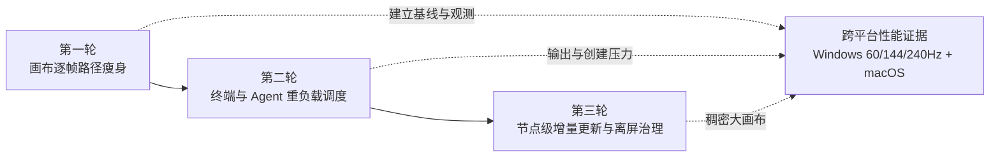

# 画布交互性能演进路线图

## 文档地位

本文记录 cleancode 在保留丝滑动效的前提下，继续优化画布、节点、普通终端与 Agent 控制台交互性能的三轮实施顺序、边界和验收方法。

本文是实施路线，不是当前能力清单。尚未完成的条目不得被表现层、测试或其他文档当作已经存在的产品行为。已经稳定交付的用户行为迁入 [UI 契约](ui-contract.md)，共享动效与性能原则迁入 [UI Style Guide](ui-style-guide.md)。

本文不重新定义当前事实：

- 画布对象、viewport、节点位置、尺寸、组合和连接事实以[积木图模型](../contexts/block-graph/block-graph.md)为准。
- 用户可依赖的选择、定位、缩放、输入激活与终端交互结果以 [UI 契约](ui-contract.md)为准。
- 画布相机、空间对象动效、可打断运动与 reduced motion 以[画布动效演进路线图](canvas-motion-roadmap.md)和 [UI Style Guide](ui-style-guide.md)为准。
- 普通终端输出顺序、背压、快照、隐藏投递和恢复以[普通终端运行时演进路线图](../terminal/runtime-roadmap.md)为准。
- Agent 身份、Provider session binding 与运行时会话事实以 [Agent 与会话生命周期](../contexts/agent/agent-session.md)为准。
- 开发阶段、TDD、门禁和跨平台验收以[开发协作规范](../engineering/development.md)与[测试规范](../testing/testing.md)为准。

路线图不设置精确交付日期。状态只表达阶段是否尚未开始、实施中或已经完成。

## 背景与当前基线

现有实现已经解决第一类明显卡顿：程序化画布相机使用基于真实时间的 `requestAnimationFrame` spring；侧边栏展开收回在运动期间以 compositor transform 为主；新 Terminal、Agent 和组合节点以最终几何进入画布，不逐帧修改 xterm 网格或 React Flow 节点尺寸。因此，动效不依赖硬编码刷新率，60Hz、120Hz 与更高刷新率共享同一物理时间线。

下一阶段的主要矛盾不再是动画曲线本身，而是动画帧与其他主线程工作竞争：

1. 用户拖动或缩放 viewport 时，顶层 React 状态和画布消费者仍可能按输入频率更新。
2. 小地图静态节点投影与动态 viewport 框可能在同一更新链路中重复工作。
3. 大量 xterm 输出、终端创建和渲染器初始化可能与画布动效争用帧预算。
4. 单个 Terminal 或 Agent 状态变化仍可能触发整组节点投影与无关节点更新。
5. 离屏节点和终端 surface 的降载空间存在，但不能以破坏 session、缓冲区或恢复连续性为代价直接卸载。

高刷新率会放大这些竞争。在 240Hz 显示器上，一次刷新间隔约为 `4.17ms`；优化目标不是强制每次业务工作都塞入这个间隔，而是把逐帧路径限制为必要的 presentation write，并把可延后的工作分片、合并或移到空闲时间。

## 目标体验

三轮完成后，用户应当形成以下稳定预期：

1. 侧边栏展开收回、画布平移缩放和程序化相机运动保持现有节奏、路径与可打断能力，不通过锁帧、缩短时长或跳过中间帧换取性能。
2. 持续终端输出、创建 Terminal 或 Agent、更新小地图时，不明显阻塞画布直接操控和终端输入。
3. 一个节点的状态变化只更新必要消费者，节点数量增加时无关 React 工作不会按整图线性放大。
4. 可见和聚焦对象优先获得渲染预算；后台对象可以延后追赶，但最终内容、顺序与当前事实一致。
5. Windows 高刷新率设备不再因 React commit、xterm 输出或初始化尖峰形成容易感知的连续掉帧；macOS 现有手感不退化。

## 全程不变量

所有轮次都必须保持以下不变量：

1. 优化只改变计算和呈现调度，不改变 BlockGraph、Run、Agent 或 Project 的业务事实与持久化格式。
2. 不设置固定 `60fps`、`120fps` 或其他帧率上限；逐帧动效继续使用浏览器刷新节奏和真实 elapsed time。
3. 不修改现有 motion token、spring 参数、最终 viewport、最终节点几何、选择、焦点和输入激活结果，除非另行完成产品确认。
4. 普通终端与 Agent 控制台的有效输出不得丢失、重复或乱序；当前运行身份、缓冲区和恢复语义不得因可见性优化改变。
5. 用户直接操控和当前聚焦终端始终优先于后台投影、持久化、小地图静态计算和非关键渲染器初始化。
6. 所有队列、缓存、重试、延迟任务和 surface 保留都必须有界，并在工作区切换、对象删除和组件释放时可取消、可清理。
7. reduced motion 继续改变运动表现而不改变最终结果；性能优化不能建立第二套 reduced-motion 判断。
8. 不依赖 React Flow、xterm 或 Electron 的私有 API；依赖升级后仍可通过公开契约回归。

## 统一语言与职责

- **交互帧路径**：用户直接操控或程序化动效期间，为生成下一可见帧必须同步完成的工作。
- **静态投影**：只在节点集合、几何或样式事实变化时需要重新计算的画布或小地图数据。
- **实时投影**：viewport 框、缩放读数、CSS transform 等需要跟随 presentation value 更新的轻量结果。
- **帧预算工作**：保持顺序但允许分片到多个帧的输出、投影或初始化任务。
- **后台追赶**：不可见或未聚焦对象在不影响当前交互的时机处理已经积累的有界工作。
- **Surface 保留**：对象暂时离屏或隐藏时保留终端视图身份与必要资源，不等同于保留业务会话事实。

根级 Presentation 拥有 viewport、React 投影与交互帧调度策略。Run 继续拥有普通终端会话和输出事实；Agent 继续拥有 Agent 身份与 Provider 会话事实；两类节点可以复用已证明安全的表现层调度基础，但不得合并领域身份、生命周期或动作语义。

## 路线总览

| 轮次 | 名称                     | 核心结果                                         | 主要收益场景                       | 状态     |
| ---- | ------------------------ | ------------------------------------------------ | ---------------------------------- | -------- |
| 1    | 画布逐帧路径瘦身         | viewport 实时值不再驱动整个画布 React 树逐帧更新 | 平移、缩放、相机运动、侧边栏动效   | 尚未开始 |
| 2    | 终端与 Agent 重负载调度  | 输出与非关键初始化按可见性、优先级和帧预算执行   | 刷日志、批量创建 Terminal 或 Agent | 尚未开始 |
| 3    | 节点级增量更新与离屏治理 | 单节点变化局部提交，离屏对象安全降载             | 多节点、多终端、长时间运行的大画布 | 尚未开始 |

三轮按风险递增推进。每轮都必须单独建立改造前基线、完成目标验证并保留可回退边界；不得把三轮合并成一次无法归因的整体重构。第一轮完成后即可独立交付，后续轮次是否全部实施应依据真实 trace，而不是预先假设每一项都必要。

## 第一轮：画布逐帧路径瘦身

### 阶段目标

把 viewport presentation value 与顶层 `WorkbenchCanvas` React 状态解耦，使平移、缩放和程序化相机运动只更新真正依赖实时值的叶子消费者。节点集合、React Flow 配置与小地图静态节点层不因每个 viewport 输入事件重复投影。

### 计划能力

1. 建立统一、轻量的 viewport presentation store，覆盖直接操控、程序化 spring、即时恢复与小地图拖动预览。
2. 使用细粒度 selector 或命令式公开写入，让小地图 viewport 框与缩放读数订阅必要字段；不得让实时值回流为整棵画布的逐帧 React state。
3. 只在 `full`、`compact`、`overview` 等细节层级阈值发生跨越时更新 React 投影，不按每个 zoom 浮点变化重复提交。
4. 把小地图拆分为节点静态层和 viewport 实时层；节点 frame、viewBox 与样式只在节点或画布边界变化时重新计算。
5. 为 viewport 发布次数、React commit、节点投影耗时、小地图投影耗时和长任务建立开发期观测，不把诊断计数写入业务状态或持久化。

### 第一轮非目标

- 不重写 React Flow 内部 pan/zoom 引擎，也不访问其私有 store。
- 不调整现有相机 spring、侧边栏 spring、节点创建 motion 或小地图视觉样式。
- 不修改 viewport 持久化频率以外的 Project 或 BlockGraph 语义；只有最终稳定结果可以沿现有入口提交。
- 不在本轮处理 xterm 输出分片和终端 surface 虚拟化。

### 第一轮验收

1. 连续 viewport presentation frame 不重新构造 React Flow `nodes`，也不触发小地图静态节点层重复计算。
2. zoom 在同一细节层级内变化时不产生层级 React state 更新；跨越阈值时只提交一次对应结果。
3. 直接操控、程序化相机、即时恢复和小地图拖动的最终 viewport 与当前实现一致。
4. 侧边栏展开收回期间同时拖动或缩放画布，不出现新的几何跳变、持久化风暴或输入接管延迟。
5. reduced motion、工作区切换、运动取消和迟到完成身份继续满足画布动效路线的不变量。

### 第一轮验证

- Unit：viewport store 的 selector 通知矩阵、相同值去重、阈值跨越、取消与最终提交。
- Unit/component：以 render/投影副作用次数为 oracle，证明实时 viewport 不重算静态节点层和 React Flow 节点集合。
- 性能 trace：空画布、中等节点和稠密节点下分别执行平移、缩放、程序化定位与侧边栏开合。
- 真实设备：至少记录 Windows 60Hz、144Hz、240Hz 与 macOS 原生刷新率；未执行的平台或刷新率必须标记为未验收。

### 第一轮退出条件

- 逐帧 viewport owner 唯一，所有实时消费者通过同一公开入口接入。
- 改造前后 trace 使用同一项目 fixture、操作序列、窗口尺寸与输出负载，可以比较 React commit 和主线程帧工作。
- 目标 unit、Presentation 回归、完整门禁与真实设备检查通过。

## 第二轮：终端与 Agent 重负载调度

### 阶段目标

让大量终端输出、终端视图 attach、渲染器初始化和创建后的非关键工作遵守可见性优先级与有界帧预算，避免它们在动画或直接操控期间长时间占用主线程。

### 计划能力

1. 为 renderer 侧 xterm 输出建立顺序保持的调度器：合并可安全合并的相邻片段，并以时间预算分片 drain，不用固定条数或固定帧率假设代替真实耗时。
2. 聚焦且可见的终端优先；可见但未聚焦终端次之；离屏或隐藏终端使用后台追赶。优先级只影响处理时机，不改变 sequence、内容和最终屏幕状态。
3. 当用户拖动画布、缩放、打开侧边栏或输入终端时，暂停或缩小非关键后台预算；交互结束后有界恢复，不产生无限饥饿。
4. 把非聚焦对象的 WebGL addon 激活、部分 raster 升级、小地图非实时重算和非关键持久化安排到首个可见节点 frame 之后或空闲时段。
5. 复用现有可见性与 raster 优先级事实，不建立与 `IntersectionObserver`、终端 raster coordinator 竞争的第二套可见性判断。
6. 记录 pending output bytes、最老片段等待时间、单次 drain 耗时、输入到回显延迟和调度降级原因，并保证诊断有界且不记录敏感输出正文。

### 第二轮非目标

- 不改变 Provider、PTY、Run 用例、IPC 输出协议、terminal sequence 或背压所有权。
- 不把 Agent 控制台合并为普通终端，也不修改 Agent thread、Provider 或 MCP 语义。
- 不通过丢弃后台输出、降低当前终端字符正确性或禁止 WebGL 换取帧率。
- 不直接卸载离屏 xterm surface；surface 生命周期和恢复风险留到第三轮评估。

### 第二轮验收

1. 相同身份与 sequence 的输出在空闲、持续动画、用户输入和后台追赶四种条件下得到一致的最终 xterm buffer。
2. 输出合并和分片不产生丢失、重复、乱序、CJK/emoji 破坏或 ANSI 边界错误。
3. 聚焦终端输入与回显不会被其他终端的大量输出长期阻塞；后台终端在交互结束后可以有界追赶。
4. 批量创建 Terminal 或 Agent 时，节点外壳和输入可用性优先出现，非关键渲染初始化不会形成连续长任务尖峰。
5. WebGL 初始化失败、context loss 与 DOM fallback 继续保持同一 session、buffer 和输入链路。

### 第二轮验证

- Unit：输出调度器的顺序、合并边界、时间预算、优先级切换、饥饿上限、取消和清理。
- Unit/integration：真实 xterm 或最小适配器验证 ANSI、Unicode、CJK/emoji、连续大输出和 context fallback。
- E2E：只有低层测试无法证明真实 Electron、xterm、GPU、持续 PTY 输出与画布动效组合风险时，增加一个最小代表性重负载主路径。
- 性能 trace：单个聚焦终端刷日志、多个后台终端刷日志、连续创建 Terminal/Agent，并同时执行侧边栏和画布操作。

### 第二轮退出条件

- renderer 输出调度只有一个顺序 owner，现有队列、背压和快照边界保持清晰。
- 可见性、聚焦和交互优先级有确定性测试，后台工作不会无限积压或泄漏。
- 第一轮性能场景无回退，终端专项回归、完整门禁与跨平台 Electron 验收通过。

## 第三轮：节点级增量更新与离屏治理

### 阶段目标

让 Terminal、Agent、组合和其他画布对象按节点身份进行局部投影与提交；在节点很多或对象离屏时，减少无关 React、样式和终端表面工作，同时保持对象身份、session、输出和恢复连续性。

### 计划能力

1. 把整组节点模板重建拆为节点级 selector、缓存或增量 patch；单个 Terminal 或 Agent 状态变化只替换必要节点数据。
2. 稳定未变化节点的对象引用和回调身份，使 memoized node component 能实际跳过无关 render。
3. 区分图事实变化、节点运行状态、临时对象 motion 和 viewport 细节投影，避免其中一个维度变化使所有维度失效。
4. 对离屏节点暂停装饰性动画、非关键测量和低优先级表面工作，但保留选择、连接、布局和恢复所需的最小几何事实。
5. 评估带宽限、数量上限与过期策略的 terminal surface lease；只有能够证明同一 session、buffer、滚动历史、搜索状态和清理语义时，才允许进一步虚拟化或暂时 detach。
6. 以节点数量、可见节点数量和活跃输出节点数量三个独立维度建立压力 fixture，避免只用总节点数解释性能。

### 第三轮非目标

- 不修改 BlockGraph 节点 schema、Agent 身份或 Run session 生命周期。
- 不假设“离屏”等于“可销毁”，也不以重新创建 xterm surface 掩盖资源治理问题。
- 不为了减少 render 合并 Terminal 与 Agent 的节点数据模型。
- 不以全局深比较替代正确的状态切分；深比较本身不得成为新的逐帧热点。

### 第三轮验收

1. 一个节点的非几何状态变化不会重建其他节点模板，也不会触发无关 Terminal 或 Agent node render。
2. 节点增加时，单节点更新成本主要由受影响节点和必要消费者决定，不随整图节点数近似线性增长。
3. 离屏降载不改变节点位置、连接端点、选择、组合、session 身份、终端缓冲区和返回可见后的最终内容。
4. 工作区切换、节点删除、运行退休和应用退出能清理所有 selector、observer、idle callback、surface lease 与缓存。
5. 长时间运行后，内存、GPU context、pending output 和保留 surface 数量均保持有界。

### 第三轮验证

- Unit/component：节点引用稳定性、单节点 patch、selector 通知矩阵、motion 与运行状态正交更新。
- Integration：surface attach/detach、可见性切换、WebGL/DOM renderer、缓冲区和滚动历史连续性。
- E2E：保留现有跨 worktree、终端日常交互和运行时恢复主路径；只有 surface 生命周期新增组合风险时才扩展最小代表性场景。
- 压力与 soak：稠密画布、多活跃输出节点、反复离屏/返回、工作区切换与长时间运行，观察 React commit、内存、GPU context 和积压上限。

### 第三轮退出条件

- 每类节点只有一个数据投影 owner，静态图事实、运行状态与 presentation motion 的失效边界可被测试证明。
- 所有离屏优化都有明确资源上限、恢复路径与清理路径；未能证明 surface 连续性的虚拟化方案保持关闭。
- 三轮性能矩阵、完整门禁、跨平台 Electron 验收与长时间运行检查通过。

## 跨轮性能证据

### 固定场景矩阵

每轮开始前必须冻结可重复的项目 fixture 和操作序列，至少覆盖：

| 维度     | 场景                                               |
| -------- | -------------------------------------------------- |
| 画布密度 | 空画布、中等节点、稠密节点                         |
| 直接操控 | 连续平移、触控板/滚轮缩放、快速接管程序化运动      |
| 外壳动效 | 侧边栏连续展开收回、新节点创建、组合展开收起       |
| 输出负载 | 无输出、单个聚焦终端持续输出、多个后台终端持续输出 |
| 创建负载 | 单个 Terminal、连续 Terminal、连续 Agent、混合创建 |
| 可见性   | 全部可见、部分离屏、工作区切换后返回               |
| 设备     | Windows 60Hz/144Hz/240Hz、macOS 原生刷新率         |

### 观测指标

性能判断至少结合以下证据，不以单个平均 FPS 作为结论：

- 刷新间隔、连续 missed frame 和主线程 long task 分布。
- React commit 次数、commit 耗时和触发组件。
- viewport 发布、节点模板投影、小地图静态投影的次数与耗时。
- xterm pending bytes、最老输出等待时间、单次 drain 耗时与输入回显延迟。
- 终端 surface、WebGL context、observer、idle callback 和缓存数量。
- 长时间运行后的 renderer 内存、GPU 资源、输出积压与清理结果。

性能报告必须同时给出改造前基线、改造后结果、fixture、设备刷新率、窗口尺寸、节点数量和输出负载。macOS 结果不能代替 Windows 验收，60Hz 结果也不能推导 240Hz 已验收。

### 阶段停止条件

每轮完成后根据真实证据决定下一轮范围：

1. 如果第一轮已经消除直接操控中的主要 React 热点，第二轮只处理输出和创建压力，不继续重写画布架构。
2. 如果第二轮后常用规模已经满足体验目标，第三轮只处理 trace 证明存在的节点级或离屏热点。
3. 如果某项优化降低平均耗时却引入输入延迟、输出错误、恢复不连续或内存增长，该项不得进入下一轮基线。

## 测试策略

最低有效层级优先为 unit 和 component：使用通知次数、投影次数、对象引用、队列顺序和调度副作用作为稳定 oracle，不把具体设备 FPS、单次毫秒数或像素级中间帧固化为单元测试契约。

真实 Electron、GPU、xterm、PTY 持续输出和高刷新率组合无法由 jsdom 证明，因此性能 trace 与跨平台真实设备检查是阶段验收证据。E2E 只保留最小代表性主路径；调度边界、优先级矩阵、错误分支和清理必须下沉到 unit、integration 或 contract。

生产代码改动完成后运行 `pnpm pre-commit`。涉及 Electron 构建、运行时装配或打包时追加 `pnpm build`。Windows、Linux 与 macOS 的支持状态只能由对应原生 runner 或真实设备证明。

## 风险与回退

- 外部 viewport store 如果形成第二个最终状态 owner，会造成 React Flow、持久化与小地图分叉；它只能拥有可丢弃 presentation value，最终事实继续沿现有入口提交。
- 输出分片如果按字符、字节或时间错误切割，可能破坏 ANSI、Unicode 或 xterm write 回调顺序；合并必须以完整输出片段为边界，sequence 是唯一排序依据。
- 过度优先前台可能让后台永远无法追赶；每个优先级都必须有界，并在交互结束后恢复预算。
- 节点级缓存如果失效维度不完整，会产生陈旧状态；缓存 key 与 selector 必须由明确事实维度驱动，不能依赖经验性的深比较。
- 直接启用 React Flow 可见节点卸载或销毁离屏 xterm 可能导致 surface 重建、buffer 恢复和滚动位置回退；第三轮在证明 surface lease 前不得采用。
- 永久 `will-change`、无上限 GPU layer、关闭 WebGL fallback 或隐藏内容可以暂时改善 trace，却会增加内存、兼容性或可访问性风险，均不属于本路线方案。

每轮必须能独立回退到上一轮的公开边界，不回滚 BlockGraph 数据、Run session、Agent 身份或用户布局。

## 维护规则

- 每轮开始时补充实际基线、选定改动范围和可行性结论；完成时更新状态、完成证据和剩余热点。
- 已交付的用户不变量迁入 UI 契约；跨组件稳定的动效与性能规则迁入 UI Style Guide；终端运行时事实迁入终端专项或 Run owner 文档。
- 路线图只保留阶段顺序、实施证据和未完成方向，不复制生产代码结构或把当前组件名升级为长期产品契约。
- 新增依赖、私有 API、持久化、IPC、跨上下文端口或终端 surface 生命周期变化时，必须重新完成 Large Change 的 Spec、可行性检查和 Plan。
- 性能参数必须来源于可重复 trace；不得因单台设备的主观手感新增固定帧率、固定批量或无设备上下文的毫秒阈值。
