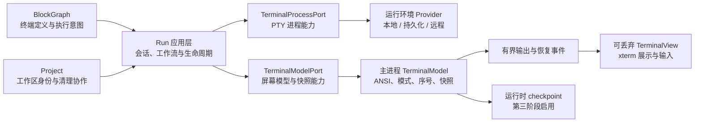

# 普通终端运行时演进路线图

## 文档地位

本文记录 cleancode 普通终端从当前进程内 PTY 会话演进为可靠、可恢复、可扩展运行时的已确认方向、阶段顺序和阶段验收边界。

本文是实施路线，不是当前能力清单。尚未完成的条目不得被表现层、测试或其他文档当作已经存在的产品行为。每个阶段进入生产实现前仍须按照[开发协作规范](../engineering/development.md)完成 Spec、可行性检查、Plan 和 TDD；阶段完成后，已经成为当前事实的规则必须迁入对应 owner 文档。

本文不重新定义当前终端业务语义：

- 普通终端会话生命周期以[终端会话生命周期](../contexts/run/terminal-session.md)为准。
- 终端积木、组合、连接和持久化配置以[积木图模型](../contexts/block-graph/block-graph.md)为准。
- 单终端、组合与工作流动作语义以[积木动作模型](../contexts/block-graph/block-action-model.md)为准。
- 依赖运行、任务、服务、就绪和失败传播以[终端依赖工作流](../contexts/run/terminal-workflow.md)为准。
- 用户当前能够依赖的交互行为以 [UI 契约](../product/ui-contract.md)为准。

路线图不设置精确交付日期。状态只表达阶段是否尚未开始、实施中或已经完成。

## 范围

本文只规划普通终端，不改变 Codex Agent 控制台的身份、thread 绑定、MCP、审批或运行时会话语义。两者可以在基础设施层复用经过证明的终端技术能力，但不得因此合并领域对象、生命周期 owner 或用户动作。

路线覆盖：

- PTY、权威终端模型和可见终端视图的生命周期。
- 输出顺序、快照、隐藏投递、背压和恢复。
- 日常终端渲染、输入、检索和链接体验。
- 应用退出、renderer 故障与运行时故障后的恢复。
- 本地、持久化和远程运行环境的统一能力边界。
- 对应的 unit、integration、contract、E2E 和性能验证。

路线不改变 BlockGraph 对终端定义和依赖图的所有权，也不把运行快照、PTY ID、进程号或输出写回积木图。

## 当前基线

当前普通终端已经具备以下可靠基础：

- `TerminalSession` 使用明确状态迁移管理一次 PTY 会话。
- 每次启动产生精确 `sessionId + runId + generation`，旧运行的迟到事件不能覆盖当前运行。
- 同一项目、目录、工作区和终端槽位的启动与清理按 owner 串行。
- 每个可恢复运行在独立本地 Provider 维护权威终端模型、单调输出 sequence 和有界 snapshot；应用内恢复对账仍经 Run 用例。
- 工作区切换会销毁旧 renderer xterm；返回时创建新视图，并按 snapshot marker 接续定向 live output。
- 隐藏普通终端停止逐字节 renderer 投递，由 Provider 模型继续解析输出并响应 terminal query。
- 模型使用 PTY pause/resume 建立背压与 query 响应权交接；renderer 恢复队列和重试均有界。
- 启动命令、停止当前命令、重开空终端和停止工作流具有不同作用对象和语义。
- 依赖工作流支持并行根、汇合等待、失败传播、任务/服务模式、就绪和反向停止。
- 受管服务具备端口策略、注入、所有权验证、释放等待和隔离语义。

当前限制：

- 只有用户明确保留且 checkpoint 可靠的普通交互/直接启动会话可以跨应用退出；工作流和默认策略会话仍会停止。
- Provider 故障后的 cold restore 只有只读 normal-buffer 历史，不恢复进程、工作流或服务端点。
- 当前 headless 模型适配器仍需随终端依赖升级重新验证序列化和协议兼容性。
- 普通终端日常交互已经覆盖搜索、安全链接、复杂输入、有界粘贴和渲染降级；更广泛平台与终端程序兼容性仍需随依赖升级持续回归。
- 当前 Provider 只支持本机运行环境；远程 Provider 与外部可编程控制协议仍未实现。

## 目标用户体验

路线完成后，用户应当能够形成以下稳定预期：

1. 切换、隐藏或重建终端视图不会误杀任务，也不会丢失已经产生的有效输出。
2. 关闭终端、删除积木、归档工作区或移除项目后，属于该作用域的进程和资源会被精确释放。
3. 大量后台输出不会明显拖慢当前正在输入的可见终端。
4. 终端画面恢复后与连续处理全部有效输出的结果一致，不重复、不缺失、不显示旧运行内容。
5. 搜索、链接、中文输入、长文本粘贴、CJK/emoji 和复杂 TUI 具有可预期行为。
6. 用户明确选择保留的普通终端可以跨应用退出继续运行，并在重新打开后恢复。
7. 本地与远程终端遵循同一套用户动作和生命周期语义，差异通过运行环境能力明确表达。

## 全程不变量

所有阶段都必须保持以下不变量：

1. `TerminalSession` 始终是普通终端 PTY 会话生命周期的事实来源。
2. BlockGraph 只持久化终端定义、布局、连接和执行意图，不持久化运行实例或技术快照。
3. 输出、退出、快照、端点和清理只能作用于完整身份匹配的当前运行。
4. `DetachView` 只改变视图连接；`RetireSession` 才永久终止会话并撤销恢复资格。
5. 一个有效输出片段只能进入对应权威终端模型一次。
6. 快照与后续实时输出合并后不得重复或遗漏有效输出。
7. 所有队列、缓冲、日志、checkpoint 和重试都必须有界。
8. 关闭、删除和清理必须幂等，迟到 spawn、输出、退出或恢复结果不得复活已退休身份。
9. 表现层只持有可丢弃视图和临时交互状态，不成为 PTY、输出历史或恢复资格的事实来源。
10. 普通终端的演进不得削弱现有工作流、受管端口、项目生命周期和 Agent 隔离语义。

## 目标架构

职责边界：

- `TerminalSession` 管理业务生命周期状态，不解析 ANSI，也不依赖具体终端库。
- Run 应用层校验身份、编排 PTY、终端模型、投递兴趣和清理顺序。
- 应用层端口表达进程、终端模型、快照和运行环境能力。
- 基础设施适配器实现 PTY、headless 屏幕模型、checkpoint 和远程协议。
- Platform 只负责 Electron IPC、进程入口和依赖装配。
- Presentation 负责 xterm、输入、选择、搜索、链接、视图可见性和用户反馈。

## 阶段总览

| 阶段 | 名称                   | 核心结果                                       | 主要用户收益                       | 状态     |
| ---- | ---------------------- | ---------------------------------------------- | ---------------------------------- | -------- |
| 1    | 权威模型与可丢弃视图   | 终端状态脱离单个 renderer xterm                | 隐藏、切换和视图重建更加可靠       | 已完成   |
| 2    | 日常交互与渲染质量     | 完整的检索、链接、输入和渲染降级能力           | 每天使用更快、更顺、更少误操作     | 已完成   |
| 3    | 跨应用存活与故障恢复   | 持久运行 provider、warm attach 和 cold restore | 退出或故障后仍能找回符合策略的终端 | 已完成   |
| 4    | 多运行环境与可编程控制 | 本地和远程 provider、CLI/受控工具协议          | 同一套终端体验覆盖更多运行环境     | 尚未开始 |

阶段必须按顺序建立稳定边界。第二阶段中不依赖持久化的独立交互能力，可以在第一阶段接口稳定后并行推进；第三、四阶段不得绕过第一阶段的权威模型和生命周期契约另建状态通道。

## 第一阶段：权威模型与可丢弃视图

### 阶段目标

把普通终端从“renderer xterm 同时承担状态和展示”演进为“主进程模型拥有状态、renderer xterm 只负责展示和输入”。本阶段仍是进程内能力，不改变应用退出时终止普通终端的当前策略。

### 用户体验变化

- 用户切换工作区或终端暂时不可见时，PTY 继续运行。
- 终端视图被销毁并重新创建后，可以恢复与当前运行一致的画面。
- 后台终端大量输出时，当前可见终端仍保持低延迟输入和回显。
- 返回隐藏终端时不会混入旧 session 输出，也不会因为快照与实时输出竞态而重复或缺行。
- 用户关闭终端、删除积木或清理工作区时，仍能确信对应资源已经被精确释放。

### 生命周期意图

| 意图                  | 视图             | PTY                        | 权威模型               | 恢复资格       |
| --------------------- | ---------------- | -------------------------- | ---------------------- | -------------- |
| `AttachView`          | 创建或绑定       | 保持                       | 保持并提供快照         | 保留           |
| `DetachView`          | 解绑或销毁       | 保持                       | 继续接收有效输出       | 保留           |
| `ReplaceSession`      | 清空并绑定新身份 | 终止旧会话、启动新会话     | 释放旧模型、创建新模型 | 仅新身份       |
| `RetireSession`       | 解绑并销毁       | 终止精确会话               | 释放                   | 撤销           |
| `ShutdownApplication` | 销毁             | 按当前策略终止全部普通终端 | 释放                   | 撤销           |
| `NaturalExit`         | 保留退出结果视图 | 已自然退出                 | 保留有界最终状态       | 当前进程内保留 |

### 计划能力

#### 1.1 契约与身份

- 定义 `TerminalModelIdentity`，必须包含完整当前运行身份。
- 定义 `TerminalSnapshot`、`OutputSequence`、`RestoreMarker` 和视图投递兴趣契约。
- 明确 attach、detach、replace、retire、natural exit 和 application shutdown 的动作入口。
- 保留现有 generation 规则，不建立第二套“当前会话”判断。

#### 1.2 主进程权威模型

- 为每个当前运行建立独立 headless terminal model。
- PTY 输出通过 `TerminalSessionService` 完成当前身份验证后，先进入权威模型。
- 模型维护恢复所需的屏幕、滚动历史、尺寸、标题、工作目录、终端模式和输出序号。
- terminal query 的响应权必须唯一，避免主进程模型和可见视图重复响应。
- 合成控制事件不得污染用户可读 transcript 或统计。

#### 1.3 有界输出与恢复顺序

- 输出事件携带同一运行身份内的单调 sequence。
- 可见视图使用低延迟投递路径。
- 隐藏视图在模型接收输出后可以停止逐字节投递，记录需要恢复的 marker。
- snapshot 生成期间到达的实时输出进入有界 pending 队列。
- 视图按 `snapshot sequence → pending live output → normal live output` 恢复。
- 缓冲达到上限时使用明确的恢复或生产者背压策略，不允许无界增长。

#### 1.4 可丢弃视图

- `TerminalSurfaceRegistry` 从终端状态 owner 收缩为视图复用与资源管理组件。
- `TerminalViewport` 的卸载只提交 detach，不触发 session retirement。
- 新建 xterm view 时先建立恢复边界，再写入 snapshot，最后接续实时输出。
- resize 使用模型已确认尺寸和当前视图尺寸对账，避免隐藏期间的旧尺寸覆盖新尺寸。
- 初始启动仍等待首个可靠终端尺寸，不退化现有 CJK、emoji 和裁剪行为。

#### 1.5 清理、诊断与资源预算

- replace、retire、项目/工作区硬清理和应用退出必须同时释放 PTY、模型、缓冲、订阅和计时器。
- 对迟到输出、迟到退出、重复 detach、重复 retire 和恢复失败建立结构化诊断。
- 建立隐藏终端数量、模型数量、renderer xterm 数量、pending 字节和恢复耗时的可测试指标。
- 性能门禁使用明确预算，不只依赖人工观察。

### 第一阶段非目标

- 不让 PTY 跨应用退出存活。
- 不把快照或输出写入磁盘。
- 不恢复应用退出前的普通终端。
- 不恢复中断的 `WorkflowRun`。
- 不新增远程运行环境。
- 不同时引入全部终端交互和渲染增强。

### 第一阶段验收

1. 同一 PTY 在视图销毁并重新创建后恢复正确屏幕内容。
2. 隐藏期间的有效输出在返回后可见，且没有重复、缺失或旧身份污染。
3. alternate screen、光标、颜色和已纳入本阶段的终端模式可正确恢复。
4. 当前可见终端的短输入不会被后台持续输出明显延迟。
5. renderer 待处理输出和所有恢复缓冲均有明确上限。
6. replace、retire、工作区清理和应用退出后不存在遗留模型、订阅、计时器或 PTY。
7. 启动命令、Ctrl+C、重开空终端、工作流和受管服务端口行为保持不变。
8. 现有跨工作区终端保留路径继续通过，并增加真实视图重建恢复路径。

### 第一阶段验证

- Unit：生命周期意图、身份过滤、sequence、缓冲上限、快照与实时输出合并、幂等清理。
- Integration：真实 headless 模型对 ANSI、resize、alternate screen、模式和 dispose 的处理。
- Contract：main/preload/renderer 对 snapshot、sequence、restore marker 和可见性意图的共同理解。
- E2E：真实 Electron、node-pty、IPC 和 xterm 下，销毁视图、隐藏输出、重新创建并恢复同一 session。
- Performance：前台输入延迟、后台输出吞吐、隐藏终端资源占用和恢复耗时。

### 第一阶段退出条件

- 所有验收条目有自动化证据。
- 当前行为文档已经更新为新的事实来源，不再把 xterm surface 描述为恢复权威。
- 未完成的兼容路径具有明确 kill switch 或回退策略。
- 未发现无界缓冲、重复 query 响应、旧 generation 污染或资源泄漏。

### 第一阶段完成证据

第一阶段于 2026-07-20 完成：

- `TerminalSessionService` 保持 PTY 生命周期 owner，并在有效输出进入应用消费者前只写入 `TerminalModelPort` 一次。
- 主进程 headless 模型维护有界滚动历史、ANSI 屏幕、alternate buffer、模式、标题、工作目录、sequence、snapshot、transcript 和恢复耗时指标。
- 模型待解析输出以 1 MiB / 256 KiB 高低水位控制 PTY pause/resume；renderer 恢复队列上限为 1 MiB，sequence 缺口和溢出进入有界重新 attach。
- attach/detach 通过暂停 PTY、flush 模型和确认后销毁旧 xterm 交接 terminal query 响应权；真实 Electron 测试证明可见与隐藏状态都只产生一次查询响应。
- renderer 每次挂载创建新 xterm，snapshot 按原始尺寸恢复后接续 marker 之后的 live output；隐藏普通终端不再接收逐字节输出。
- replace、显式 terminate 和应用清理释放模型；natural exit 只在当前进程内保留最新 generation 的有界最终模型，后续 replacement 会撤销恢复资格。
- Unit、Integration、Contract 和 E2E 分别覆盖身份与生命周期、真实 headless ANSI/模式/背压、IPC 恢复契约，以及真实视图销毁重建、隐藏输出和早期 scrollback。

## 第二阶段：日常交互与渲染质量

### 阶段目标

在稳定 model/view 边界上补齐高频终端体验，使普通命令、长日志、复杂 TUI、多语言输入和常见开发导航都具有一致行为。

### 用户体验变化

- 用户可以搜索当前终端的可读历史并在结果间导航。
- 文件路径、行列位置和 HTTP/HTTPS 地址可以安全打开。
- 用户可以按需要配置合理范围内的 scrollback。
- 中文输入、emoji、CJK 标点、组合键和复杂键盘布局不会误提交或吞字。
- 多行和超大文本粘贴不会阻塞 renderer，也不会破坏终端 paste mode。
- 支持时使用高性能渲染；GPU 或 context 异常时自动回退，不留下黑屏或乱码。

### 计划能力

- 搜索：增量查询、上一项/下一项、结果计数、关闭后恢复焦点。
- 链接：URL、工作区内文件路径、行号和列号；打开前验证作用域与路径。
- Scrollback：提供有限预设和规范化策略，模型、snapshot 和视图使用同一预算。
- Unicode：统一字符宽度来源，并继续覆盖 CJK、emoji、组合字符和标点。
- IME：显式追踪 composition 生命周期和候选阶段，避免 Enter、Escape、Backspace 被错误转发。
- 粘贴：识别 bracketed-paste mode，限制输入大小，按 UTF-8 边界分片，并保证取消或失败时闭合协议。
- 剪贴板：区分文本、文件和图片来源；高风险终端控制序列采用明确权限策略。
- 渲染：高性能 renderer 自动探测、context-loss 处理、DOM fallback 和诊断记录。
- 可访问性：搜索、链接、终端状态和交互入口提供键盘路径与稳定可访问名称。

### 第二阶段非目标

- 不改变普通终端应用退出策略。
- 不引入磁盘 checkpoint 或远程 provider。
- 不让链接解析结果成为新的业务事实来源。
- 不通过颜色或动画替代终端状态文本。

### 第二阶段验收

1. 搜索可以覆盖模型保留范围内的历史，并在视图恢复后继续工作。
2. 文件和 URL 链接不会跨出当前允许作用域或打开未经验证的危险目标。
3. scrollback 设置在允许范围内生效，异常旧值确定性迁移。
4. 中文 IME、CJK/emoji、常用非美式键盘和组合键测试通过。
5. 大文本粘贴有界、可取消，失败后终端不会遗留未闭合 paste mode。
6. 高性能渲染不可用或丢失 context 时自动回退，输入和画面继续可用。
7. 日常交互增强不改变第一阶段的权威模型和恢复顺序。

### 第二阶段验证

- Unit：搜索状态、链接解析与授权、scrollback 规范化、IME、粘贴分片和渲染选择策略。
- Integration：终端模式与输入协议、文件路径打开适配器、渲染 fallback 生命周期。
- E2E：只覆盖低层测试无法证明的真实输入、GPU fallback 和复杂终端主路径。
- Visual：CJK/emoji、滚动条、搜索覆盖层、链接和 context 恢复截图证据。

### 第二阶段退出条件

- 高频交互均有稳定键盘路径和错误反馈。
- GPU、IME、粘贴和链接失败不会破坏会话或模型状态。
- 长日志和复杂 TUI 的表现、内存与恢复预算达到阶段目标。

### 第二阶段完成证据

第二阶段于 2026-07-21 完成：

- 普通终端提供增量搜索、结果计数、上一项/下一项、键盘关闭和焦点恢复；snapshot restore 后会用当前查询重新建立匹配。
- HTTP/HTTPS 与工作区文件链接通过完整运行身份、最新工作目录、真实路径和文件类型校验；失效作用域、不存在目标、越界路径、其他 URI scheme 与符号链接逃逸均失败关闭。
- 应用设置提供 1000、5000、10000 行滚动历史预设；默认和异常值确定性回退到 1000，当前及后续权威模型、snapshot 和视图使用同一预算。
- 主进程模型与可见终端统一使用 Unicode 11；IME 候选阶段不触发搜索或复制快捷键。
- 文本和文件粘贴经过来源识别、1 MiB 总量限制、UTF-8 分片、串行写入、风险确认和文件路径转义；取消或失败仍闭合已经打开的 bracketed-paste，图片不会写入 PTY。
- 可见终端优先尝试 WebGL，并在加载失败或 context loss 时保留同一 session 和 surface 自动回到 DOM；诊断状态可区分两类 renderer。
- Unit、Integration 和 Contract 覆盖搜索交互、链接解析与授权、文件系统真实路径、滚动历史规范化、粘贴协议、renderer 选择和 IPC 边界。
- 真实 Electron 场景在同一 session 中证明中文、emoji、组合字符、搜索、WebGL context loss 后的 DOM fallback 以及降级后的 ClipboardEvent → IPC → PTY 粘贴；截图证据确认搜索浮层、结果计数和匹配高亮可读。

## 第三阶段：跨应用存活与故障恢复

### 阶段目标

引入独立于 Electron renderer 和普通应用退出的持久运行 provider，并用进程内快照、磁盘 checkpoint 和输出记录提供 warm attach 与受控 cold restore。

### 用户体验变化

- 用户明确选择保留的普通交互终端或直接启动命令，可以在应用关闭后继续运行。
- 重新打开应用后优先重新连接仍存活的精确会话。
- 持久运行进程异常终止时，可以恢复有界历史、屏幕快照、cwd 和退出说明。
- 用户关闭终端、删除积木或移除工作区后，后台会话不会偷偷继续运行。
- 应用能够明确告诉用户当前是实时重连、历史恢复还是新建 shell。

### 持久化边界

- BlockGraph 继续只保存执行意图，不保存运行时 checkpoint。
- checkpoint、输出日志、运行 provider identity 和恢复元数据属于 Run 基础设施的独立版本化存储。
- PID 不能单独作为恢复或终止依据；恢复必须验证 provider identity、进程存活证据和完整运行 scope。
- 用户永久关闭、删除终端或删除工作区时必须撤销恢复资格并删除对应 checkpoint。
- 应用正常退出保留会话与用户明确永久关闭会话必须走不同动作。

### 计划能力

#### 3.1 持久运行 Provider

- 在现有进程端口后增加可 attach、detach、query、shutdown、serialize 和 revive 的 provider 能力。
- 持久运行进程拥有独立协议版本、认证材料、进程启动时间和健康状态。
- 应用断开连接不等于 provider shutdown。
- provider 升级或健康检查失败时优先保护仍可证明存活的用户会话，不冒险批量终止。

#### 3.2 Warm attach

- 应用启动后按持久化恢复元数据寻找精确 provider session。
- attach 成功后以 provider 权威模型快照恢复，再继续实时输出。
- 会话已经不存在时，明确显示过期或已结束，不伪装成原进程仍在运行。
- 新建 shell 必须产生新运行身份，不能复用失效 identity。

#### 3.3 Checkpoint 与 cold restore

- 周期性保存有界屏幕快照、scrollback 引用、cwd、尺寸、标题、模式和最后 sequence。
- 输出记录使用追加式、有界和可截断格式，异常结束后可识别不完整尾部。
- cold restore 只恢复历史视图和启动上下文，不声称旧进程仍然存活。
- alternate screen 与普通 scrollback 分别保存，避免 TUI 屏幕覆盖可读历史。

#### 3.4 生命周期与退出策略

- 提供清晰的应用退出保留策略和用户反馈。
- `RetireSession`、删除积木、归档工作区、删除项目始终覆盖普通 detach 策略。
- 迟到 spawn 必须在 owner 已退休时立即终止。
- 断电或强制结束后，下次启动根据 checkpoint 与 provider 证据对账。
- 历史清理、容量上限和保留周期必须可预测。

### 工作流边界

普通终端 PTY 跨应用存活不等于 `WorkflowRun` 已恢复。第三阶段首先只允许普通交互会话和非工作流直接启动会话采用持久运行策略；活动工作流在应用退出时继续按当前规则停止。

恢复中断的 `WorkflowRun` 必须另行建立工作流 checkpoint、调度器恢复、服务就绪复核、端口租约恢复和失败传播 Spec。在这些语义落地前，界面不得把存活的单个 PTY 显示为已经恢复的工作流。

### 第三阶段非目标

- 不以 PID 文件作为唯一存活证明。
- 不无限保存原始输出。
- 不默认让所有会话跨应用退出存活。
- 不自动恢复活动工作流。
- 不把历史恢复画面描述为实时进程。
- 不在本阶段同时加入远程运行环境。

### 第三阶段验收

1. 符合策略的普通终端在应用正常退出后继续运行并可 warm attach。
2. 用户永久关闭或删除作用域后，对应 provider session 和恢复资料均被清理。
3. renderer 故障、应用故障和 provider 故障分别收敛到准确的恢复行为。
4. cold restore 能恢复有界历史、cwd、尺寸和模式，但不会伪造进程存活。
5. 协议升级、旧 checkpoint、损坏尾部和部分写入均能安全失败或迁移。
6. 存储容量、输出记录、checkpoint 周期和清理时间都有明确上限。
7. 活动工作流在没有独立恢复模型时不会被错误恢复。

### 第三阶段验证

- Unit：退出策略、恢复资格、checkpoint 状态机、版本迁移和清理规则。
- Integration：真实持久运行进程、应用断开/重连、checkpoint 写入和异常尾部恢复。
- Contract：应用与 provider 的版本、认证、attach、snapshot、shutdown 和错误契约。
- E2E：应用退出重开、renderer crash、provider crash、永久关闭和工作区删除。
- Soak：长时间运行、持续输出、多次重连、磁盘容量和进程泄漏检查。

### 第三阶段退出条件

- “继续运行”“历史恢复”“已结束”“新建会话”在状态和交互能力上可区分。
- 所有永久关闭路径都能证明资源与恢复资格已经清理。
- 强制结束和部分失败不会导致错误复活、误杀无关进程或无界磁盘增长。

### 第三阶段完成证据

第三阶段于 2026-07-21 完成：

- Electron main 通过带协议版本、随机认证 token、Provider instance、单 controller 和启动锁的本机长度帧协议连接独立终端 Provider；Provider 拥有普通交互/直接启动 PTY、headless 模型和权威输出 sequence，renderer 或 main 退出不等于 Provider shutdown。
- Provider 启动锁采用带唯一 owner 和取得时间的短期租约：空白/损坏写入经过有界宽限后可恢复，死亡或超期 owner 可回收，所有权校验阻止旧租约误删后继锁；同一应用内并发终端共享单次连接，退出等待在途连接收敛，断连设置在重连后回放。
- 会话级退出保留默认关闭，只允许当前 `interactive/direct` 运行会话明确启用；从已保留普通会话执行“启动命令”时，新 `direct` generation 在自身 checkpoint 成功后继承保留，重开空会话、新建终端、工作流和其他 replacement 仍恢复默认。首次 checkpoint 失败时回滚，运行中持久化失效时自动撤销保留并同步 UI；`workflow` 不可保留且不会被恢复为活动工作流，运行期间的禁用图钉通过鼠标与键盘 tooltip 解释这一限制。
- warm attach 通过认证 Provider 和完整 `TerminalRunScope` 恢复同一个 live session、模型 snapshot 与后续输出；Provider 丢失时只从 schema v1 checkpoint 和连续输出记录恢复 normal-buffer 历史、cwd、尺寸与模式，不声明进程仍存活，也不让 alternate screen 覆盖可读历史。
- checkpoint 使用同步临时文件、原子重命名和目录同步；单 checkpoint 12 MiB、单输出日志 4 MiB、冷历史 64 个、总量 512 MiB、保留 7 天，容量清理只淘汰冷历史。损坏/未知版本按 session 隔离，live 会话不因清理预算被终止。
- retained 受管直接启动服务在应用重开后必须重新证明同一 live session、根进程与监听祖先所有权，才重建端口租约和实际端点；cold history 不恢复端点。
- 显式终止、replacement、删除积木、物理工作区归档/移除和项目移除继续走 Run 硬清理，覆盖退出保留并删除恢复资格/checkpoint；默认工作区分支 checkout 保留相同 PTY 与恢复资格。E2E 证明永久关闭和项目移除后 PTY 与恢复目录都被清理。
- UI 不在终端标题栏常驻重复会话状态或恢复类型；当前权威状态通过输入能力、运行中动作和带可访问名称的会话保留开关体现，并在启动恢复对账完成前阻止自动创建 shell 抢占旧 identity。
- Unit/Integration 覆盖退出策略、启动租约损坏/超期/并发/所有权安全、运行中存储降级、协议分帧/预算、认证、Provider 断连重连、checkpoint/输出 replay、alternate buffer 和端点所有权恢复；真实 Electron E2E 覆盖正常重启、中断锁下多个终端重启、renderer/main/Provider 故障、永久关闭、项目移除和工作流不恢复。
- 当前事实迁入[终端会话生命周期](../contexts/run/terminal-session.md)、[本地服务端口治理](../contexts/run/service-port-management.md)、[终端依赖工作流](../contexts/run/terminal-workflow.md)、[项目与分支工作区生命周期](../contexts/project/workspace-lifecycle.md)、[架构文档](../engineering/architecture.md)和 [UI 契约](../product/ui-contract.md)。

## 第四阶段：多运行环境与可编程控制

### 阶段目标

在统一生命周期和模型契约上支持不同运行环境，并提供受控、可审计的外部终端操作入口。

### 用户体验变化

- 用户可以在本地、系统子环境或远程主机中使用一致的终端操作。
- 切换视图、关闭、重连、resize、Ctrl+C 和恢复具有一致语义。
- 网络断开时能区分终端仍在远端运行、连接正在恢复和会话已经失效。
- 用户或授权工具可以列出、读取、发送、等待和终止精确终端，而不必模拟点击界面。
- 远程服务地址可以安全发现和转发，同时保留 cleancode 受管端口的所有权语义。

### 计划能力

#### 4.1 运行环境 Provider

- 统一表达 spawn、attach、write、resize、signal、snapshot、cwd、shutdown 和 capability query。
- 运行身份加入稳定执行主机和 provider identity，不依赖本地路径猜测远程 owner。
- provider 明确声明是否支持权威 snapshot、生产者背压、进程树清理、端口观察和持久 attach。
- 不支持的能力必须返回结构化不可用结果，不静默模拟成功。

#### 4.2 连接与恢复

- 网络短暂中断保留本地恢复边界和远端 session identity。
- 重连成功后通过 snapshot 与 sequence 对账。
- 用户永久关闭离线会话时建立可验证 tombstone，避免重连后复活。
- provider 无法证明终止成功时保持隔离状态，不把未知状态显示为已关闭。

#### 4.3 可编程终端控制

- 提供 list、show、read、send、interrupt、wait、close 和 focus 等最小操作。
- 每次操作必须解析到完整运行身份并执行作用域授权。
- `read` 使用有界分页或 cursor，不返回无界历史。
- `send` 区分原始按键、文本粘贴和中断，不把任意字符串直接解释为高权限动作。
- 由运行期 Agent 调用时必须通过正式工具协议、审批和审计，不建立内部后门。

#### 4.4 服务发现与转发

- 在受管端口之外观察用户手动启动的监听服务。
- 从终端输出提取候选 URL 时处理 ANSI、分块和监听进程变化。
- 观察到的端口和 URL 只是易失发现结果，不写回 BlockGraph 执行配置。
- 远程端口转发必须绑定精确主机、会话和本地端点，并具有独立清理生命周期。
- 端口观察不能替代受管服务的分配、注入、所有权验证和就绪语义。

### 第四阶段非目标

- 不假设所有 provider 都具有同等能力。
- 不使用 renderer 本地路径作为远程工作区事实。
- 不允许外部控制接口绕过 Run 用例、审批、审计或生命周期 gate。
- 不因远程支持而降低本地受管端口和进程清理不变量。

### 第四阶段验收

1. 相同用户动作在不同 provider 上具有一致结果或明确的能力不可用反馈。
2. 网络断开、重连、永久关闭和 tombstone 不会造成重复会话或错误复活。
3. 外部终端操作全部按精确身份授权，并具有输入上限和结构化结果。
4. 远程输出、snapshot 和实时数据继续遵守第一阶段的 sequence 规则。
5. 服务发现与受管端口在界面和状态 owner 上明确区分。
6. 路径、shell、signal、进程树和 resize 的平台差异由 provider 处理，不泄漏到领域层或 UI 业务判断。

### 第四阶段验证

- Unit：provider capability、身份解析、tombstone、命令授权、分页和端口观察策略。
- Integration：每类 provider 的 spawn/attach/write/resize/signal/snapshot/shutdown 契约。
- Contract：IPC、外部控制协议、运行期 Agent 工具和 provider 版本。
- E2E：断线重连、远程关闭、服务转发和跨运行环境主要用户路径。
- Soak：长连接、重复重连、持续输出、网络抖动和资源清理。

### 第四阶段退出条件

- provider 差异通过能力契约表达，领域和表现层没有平台命令分支扩散。
- 离线关闭、重连和端口转发不存在已知资源泄漏或身份混淆。
- 外部控制能力经过授权、审计、输入限制和协议兼容性验证。

## 阶段顺序的理由

### 第一阶段先解决正确性和所有权

如果没有权威模型、sequence 和生命周期意图，后续搜索、持久化和远程恢复都会各自建立状态副本。用户最终会遇到重复输出、旧会话污染、关闭后仍运行或恢复画面与真实进程不一致的问题。

### 第二阶段在稳定视图边界上提供高频价值

搜索、链接、IME、粘贴和渲染增强主要改变视图与输入层。先稳定 model/view 契约，可以避免这些能力在持久化和远程阶段重新接线，同时让用户尽早获得每天都能感知的提升。

### 第三阶段必须建立在恢复正确性之上

进程跨应用存活只是恢复的一部分。没有 snapshot、sequence、恢复资格和永久关闭语义时，保留进程会放大资源泄漏和错误状态风险。

### 第四阶段最后扩展运行位置和控制入口

远程和外部控制会增加网络断开、能力差异、授权和协议兼容问题。它们应复用已经证明的本地生命周期和终端模型，而不是建立平行实现。

## 实施记录

| 项目                | 状态     | 完成证据                              |
| ------------------- | -------- | ------------------------------------- |
| 路线文档            | 已完成   | 本文                                  |
| 第一阶段 Spec       | 已确认   | [第一阶段完成证据](#第一阶段完成证据) |
| 第一阶段可行性检查  | 已完成   | [第一阶段完成证据](#第一阶段完成证据) |
| 第一阶段 Plan       | 已确认   | [第一阶段完成证据](#第一阶段完成证据) |
| 第一阶段 TDD 与实现 | 已完成   | [第一阶段完成证据](#第一阶段完成证据) |
| 第二阶段            | 已完成   | [第二阶段完成证据](#第二阶段完成证据) |
| 第三阶段            | 已完成   | [第三阶段完成证据](#第三阶段完成证据) |
| 第四阶段            | 尚未开始 | —                                     |

每次阶段状态变化时更新本表，并链接对应的 owner 文档、测试或验证记录。不得只把勾选状态作为完成证据。

## 文档同步规则

- 第一阶段落地后，更新终端会话生命周期、架构文档、终端渲染排障指南和相关测试矩阵。
- 第二阶段产生稳定用户行为后，更新 UI 契约；视觉和组件规则只进入 UI Style Guide。
- 第三阶段落地后，更新终端会话生命周期、项目/工作区清理协作、架构中的持久化事实和运行数据说明。
- 第四阶段落地后，更新上下文地图、运行环境端口、外部协议和安全审计 owner 文档。
- 已完成能力必须迁入当前事实 owner；本文只保留阶段结果和仍未完成的后续方向，不复制稳定规则全文。
- 阶段被放弃或替换时直接更新当前方向，不保留失效约束，历史由 Git 承担。
