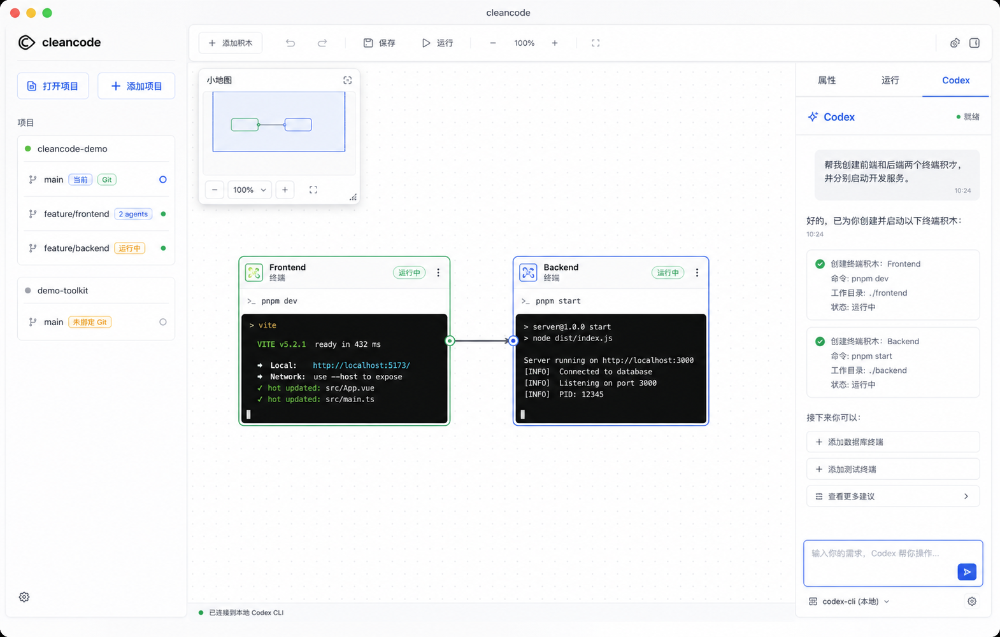
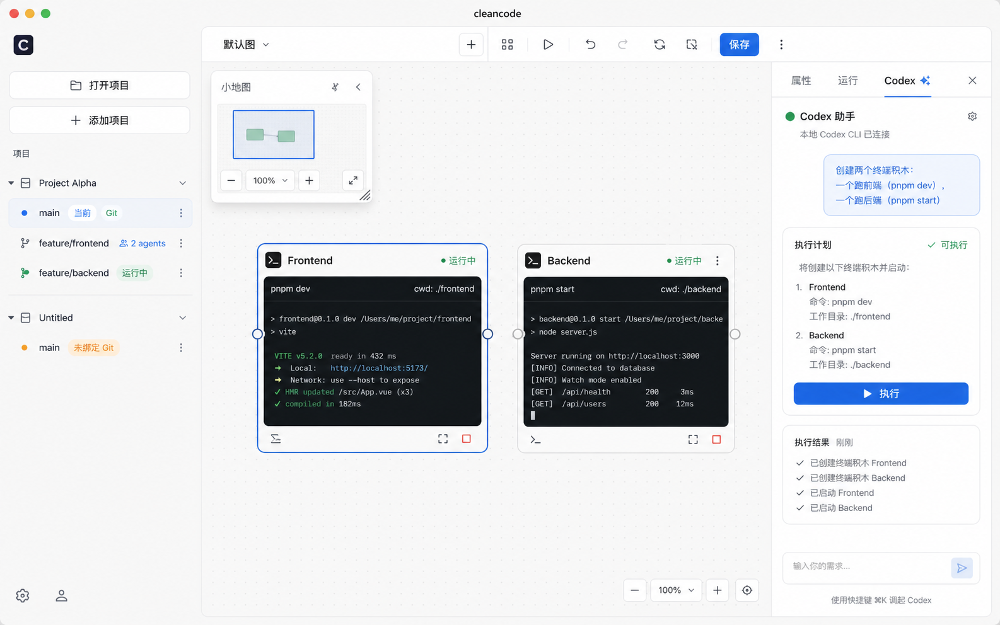

# UI 规范

## 文档地位

本文定义 cleancode 第一版功能阶段的 UI 布局和用户可见功能。

本文不重新定义架构规则、限界上下文、依赖方向或业务事实来源。架构规则以 [架构文档](architecture.md) 为唯一事实来源。

## 第一版 UI 定位

第一版 UI 采用 C 版方案作为基准：

```txt
画布优先的本地项目工作台
```

第一版 UI 不是欢迎页、文件管理器、聊天应用或完整 IDE。第一版 UI 必须让用户进入项目后直接看到积木画布，并能在画布上使用终端积木完成真实开发命令。

## 参考图

以下两张图是第一版 UI 的视觉参考。参考图只表达布局、密度和交互方向，不替代本文的文字规则。





## 信息架构

第一版 UI 固定由以下区域组成：

```txt
应用窗口
  ├─ 左侧边栏：项目与分支工作区
  ├─ 主工作区：积木画布
  │   └─ 左上角小地图
  └─ 右侧 Agent 面板
```

左侧边栏、主工作区和右侧 Agent 面板是第一版 UI 的顶层结构。不得增加文件树、底部全局 Dock、营销式 Hero、独立欢迎页或与第一阶段目标无关的常驻面板。

## 左侧边栏

左侧边栏只承载项目和分支工作区导航。

左侧边栏必须包含：

- 添加项目。
- 项目列表。
- 每个项目下的分支工作区列表。
- 当前项目和当前分支工作区的选中状态。

左侧边栏可以包含以下项目与分支工作区操作：

- 从项目列表移除项目。
- 为项目创建分支工作区。
- 在默认工作区中选择或检出已有 Git 分支。
- 归档非默认分支工作区。

左侧边栏不得包含：

- 文件树。
- 源码搜索。
- Git 提交历史。
- 运行日志。
- 插件市场。
- 积木属性表单。

项目下必须至少显示一个名为 `main` 的分支工作区。

`main` 与“默认工作区”是同一个概念。系统不得再显示另一个名为“默认工作区”的并列条目。

当项目尚未初始化 Git，`main` 仍然作为逻辑分支工作区显示，但不绑定任何真实 Git 分支。

当项目已经初始化 Git，`main` 可以绑定真实 Git 分支。绑定状态不改变用户看到的主条目名称。

分支工作区代表一个完整工作面。切换分支工作区时，用户看到的积木图、终端积木、终端会话和未来 Agent 会话都必须切换到该工作面。

多 Agent 并行开发必须以分支工作区作为用户可理解的工作边界。底层未来可以用 Git worktree 隔离并行工作目录，但 UI 不得把 worktree 路径作为主要概念暴露给用户。

工作区列表必须用徽标或辅助文本区分默认工作区、独立 worktree 工作区和绑定 Git 分支，但主要入口名称仍然是用户可理解的分支工作区名称。

默认工作区允许通过弹出层选择已有 Git 分支。弹出层必须包含搜索输入、分支列表、当前分支状态和不可选择分支的禁用状态。输入框必须有明确占位符或标签，例如“搜索分支”。

创建分支工作区时必须使用就地表单或轻量弹出层。分支名称输入框必须有明确标签或占位符，例如“分支名称”。

归档工作区必须二次确认。确认文案必须说明归档会移除 worktree 目录但保留 Git 分支；如果归档当前工作区，必须说明会先切回默认工作区。

## 主工作区

主工作区是积木画布。

积木画布必须占据窗口的主要面积，不能放在装饰性卡片里。

第一版画布必须支持：

- 展示当前项目和当前分支工作区的默认积木图。
- 创建终端积木。
- 选择终端积木。
- 多选终端积木。
- 移动终端积木。
- 调整终端积木大小。
- 删除终端积木。
- 保存终端积木位置和基本信息。
- 保存终端积木大小。
- 保存画布视口位置和缩放比例。
- 创建终端组合。
- 选择、移动、折叠、展开和解散终端组合。
- 再次启动应用后恢复积木图。

画布工具栏必须位于主工作区内，不得成为全局 Dock。工具栏必须提供：

- 新建终端积木。
- 组合终端。
- 组合编辑模式下的已选择未组合终端数量、创建组合和完成。

当没有当前项目或当前运行时不可用时，相关按钮必须禁用或展示明确空状态。浏览器预览模式必须提示真实项目、文件系统和终端能力只能在 Electron 桌面应用中使用。

第一版画布可以延后：

- 自动布局。
- 框选。
- 框选式批量操作。
- 复杂连线编辑。
- 多画布标签。
- 白板绘制。
- 文件节点。
- 代码预览节点。

## 小地图

小地图采用 D 版中的简易积木表达，但必须服务于 C 版主界面。

小地图固定出现在主工作区左上角。它可以覆盖画布，但不得遮挡左侧边栏。

小地图必须支持：

- 用简化块展示当前积木图结构。
- 折叠后的终端组合必须作为组合缩略块展示；展开时不得额外展示组合外框，只展示成员终端缩略块。
- 展示当前画布视口位置。
- 放大。
- 缩小。
- 适应画布。
- 收起或展开。
- 点击终端缩略块以定位对应终端。
- 拖动画布视口框或点击空白区域以移动主画布视口。

小地图中的终端缩略块必须表达选中、悬停、运行、失败等可见状态。小地图状态颜色必须服务于导航，不得替代终端积木自身的状态表达。

小地图中的终端组合缩略块必须沿用组合节点的浅色卡片语义，并用成员摘要行表达组合内容，不得渲染成黑底终端屏幕。

小地图不得展示终端输出、完整属性、文件内容或 Agent 对话内容。

## 终端积木

终端积木是第一版唯一必须承载真实本地运行能力的积木类型。

终端积木在画布上是积木节点，在运行时承载一个交互式本地终端会话。

终端积木必须支持：

- 显示积木名称。
- 显示积木描述。
- 显示终端状态。
- 启动终端会话。
- 配置启动命令。
- 启动已配置的启动命令。
- 输入命令。
- 显示标准输出。
- 显示标准错误。
- 发送 Ctrl+C 停止当前命令。
- 重开空终端会话。

终端积木必须尽量接近平常使用的终端体验。用户应该可以用它运行前端、后端、测试、构建和普通 shell 命令。

终端会话的默认工作目录必须来自当前分支工作区对应的本地目录。第一阶段没有独立 worktree 时，该目录就是项目目录。

终端积木头部必须包含：

- 终端图标。
- 名称。
- 描述。
- 状态。
- 编辑终端信息。
- 启动命令。
- 停止当前命令。
- 更多终端操作。
- 删除终端。

终端头部按钮优先使用图标和工具提示。除非当前处于编辑或选择模式，终端积木不得把属性表单常驻展示在头部。

终端状态必须至少区分：

- 未启动。
- 运行中。
- 已退出。
- 失败。

运行中状态必须有明确状态点或同等强度的可见提示。失败状态必须与运行中状态颜色不同。

### 终端信息编辑

编辑终端信息必须以锚定在终端积木上的轻量浮层、弹出层或同等密度的编辑面板呈现，不得把多个输入框直接塞成一整条常驻工具栏。

编辑表单必须包含：

- 终端名称。
- 终端描述。
- 启动命令。
- 保存。
- 取消。

每个输入框都必须有对应标签和占位符或提示语，说明该字段用途。占位符示例：

- 名称：`例如：Web Server`。
- 描述：`例如：本地开发服务`。
- 启动命令：`例如：pnpm dev`。

名称不能为空。保存时必须裁剪名称、描述和启动命令首尾空白。取消编辑必须恢复打开表单前的值。

从“启动命令”进入配置时，编辑表单必须直接聚焦启动命令输入框。

### 启动命令

启动命令入口必须直接放在终端积木头部的主要操作区，而不是藏在编辑表单或二级菜单里。

启动命令按钮必须用可见状态区分是否已经配置启动命令：

- 未配置：按钮仍可点击，点击后进入启动命令配置状态。
- 已配置：按钮点击后直接运行启动命令。

未配置和已配置状态必须使用不同颜色、tooltip 或辅助属性表达，但不得仅依赖颜色。

当启动命令为空时，点击启动命令必须打开终端信息编辑表单，并聚焦启动命令输入框。

当启动命令已配置时，点击启动命令必须按以下语义执行：

1. 终止该终端积木当前旧会话。
2. 启动一个新的终端会话。
3. 清空该终端积木的可见输出。
4. 向新会话写入且只写入一次启动命令。

启动命令不得把启动命令喂给正在运行的旧项目进程。这样可以避免旧进程吞掉命令、输出混在一起或同一个启动命令被运行多次。

启动命令过程中，同一个终端积木必须防抖或互斥，避免用户连点造成重复启动。

启动命令入口仍只属于单个终端积木。组合终端的“启动组合命令”会对每个成员终端执行批量启动：已配置启动命令的成员必须按启动命令语义替换旧会话、清空可见输出并写入启动命令一次；未配置启动命令的成员只启动新的终端会话。

### 重开空终端会话

重开空终端会话属于低频会话管理动作，必须放在终端头部的“更多终端操作”菜单内，不得作为主按钮直接展示。

重开空终端会话必须按以下语义执行：

1. 终止该终端积木当前旧会话。
2. 启动一个新的终端会话。
3. 清空该终端积木的可见输出。
4. 不写入、不执行启动命令。

该动作的文案必须明确表达“空终端会话”，避免用户误以为它会重新运行启动命令。

## 终端组合

终端组合是画布上的组织节点，用于把多个终端积木作为一个项目运行面管理。终端组合本身不是新的本地终端会话，也不承载终端输出。

终端组合必须支持：

- 从两个或更多未组合终端创建。
- 显示组合名称。
- 在成员摘要行显示各终端运行状态。
- 启动组合命令，并运行已配置的成员启动命令。
- 停止全部成员当前命令。
- 重开组合终端会话。
- 编辑组合名称。
- 折叠和展开。
- 在组合编辑模式中通过拖放添加未组合终端。
- 在组合编辑模式中通过拖放移出成员终端。
- 添加选中的未组合终端。
- 移出选中的成员终端。
- 解散组合。

创建第一个组合时可以默认命名为“启动项目”。后续组合可以默认命名为“终端组合”。默认名称必须可编辑。

折叠后的终端组合固定采用三段信息层级：组合身份头部、直出分组工具栏和扁平成员摘要。组合身份头部只展示组合名称和折叠或展开入口，不展示成员数量或聚合运行状态；工具栏必须按运行、成员管理和组合管理等语义组织常用操作；成员摘要不得再嵌套成一组同等强调的卡片。

折叠和展开入口必须显示“展开”或“折叠”文字，不得只依赖图标表达当前动作。折叠和展开只改变组合的展示形态，不得改变成员关系或成员终端的运行状态。

终端组合的常用操作必须直接可见，不得收进“更多组合操作”菜单。直接可见操作包括：

- 启动组合命令。
- 停止全部成员当前命令。
- 重开组合终端会话。
- 编辑组合名称。
- 添加选中的未组合终端。
- 移出选中的成员终端。
- 解散组合。

折叠组合工具栏的控件表面必须遵循固定拓扑：启动、停止和重开组合终端会话分别使用独立浮起按钮；编辑组合名称使用独立浮起按钮；添加选中终端与移出选中终端共用一个双段按钮；解散组合使用独立浮起按钮。不得把三个运行操作或编辑、添加、移出三个操作重新包成同一个胶囊式按钮组。

工具栏必须使用与动作一致的图标语义：启动使用实心播放图标；重开组合终端会话使用“终端窗口与回转箭头”复合图标；解散组合使用带局部危险色提示的断开链环图标；成员行的单独移出入口使用普通链环图标。不得用通用刷新图标或单色通用解绑图标替代这些已确认的视觉资产。

解散组合只移除组合关系，必须保留原有成员终端；解散入口的提示文案必须明确这一结果，避免用户误以为会删除成员终端。

终端组合不得在身份头部重复展示成员数量或聚合运行状态。成员运行状态只在对应的成员摘要行中展示，以减少重复信息并保持标题区域简洁。

点击“组合终端”后进入组合编辑模式。组合编辑模式用于编辑终端和终端组合之间的成员关系。只要当前项目工作台可用，“组合终端”入口就必须可点击，不得因为当前未组合终端少于两个而禁用。

组合编辑模式下，画布工具栏必须显示组合编辑状态、已选择未组合终端数量、创建组合和完成。终端积木必须显示可选状态；组合内成员终端也必须可选，用于移出成员等管理动作。已在其他组合内的终端不得被选入新组合，“创建组合”只统计已选择的未组合终端。

组合编辑模式下，把未组合终端拖入一个终端组合区域并松开，必须立即把该终端加入该组合并保存。把组合成员终端拖到原组合区域外并松开，必须立即把该终端移出组合并保存。拖动过程中，目标组合必须显示加入、移出或解散的可见反馈。

创建组合至少需要两个已选择的未组合终端。少于两个已选择未组合终端时，“创建组合”入口必须禁用。

折叠后的终端组合必须展示扁平成员摘要列表。每个成员行必须包含成员名称、未启动、运行中、已退出或失败状态，以及该成员的单独移出入口。

当组合成员少于两个时，系统必须阻止继续形成无意义组合，或自动解散组合。组合编辑模式下，如果拖出成员会导致组合只剩一个成员，拖动反馈必须明确表达松开后会解散组合。UI 不得展示只有一个成员却仍可作为有效组合操作的状态。

## 右侧 Agent 面板

右侧 Agent 面板是未来本地 Codex CLI 或其他本地 CLI Agent 的固定入口。

Agent 面板不是积木。Agent 是操作积木和工作区的参与者，不能被建模成画布上的普通积木节点。

第一阶段不接入真实 AI CLI，不实现 Agent 创建积木、修改积木图或运行终端的能力。

第一阶段可以保留 Agent 面板的布局位置和空状态，但不得让用户误以为 AI 能力已经可用。

后续阶段中，本地 Codex CLI 必须通过应用层用例操作项目、分支工作区、积木图和终端会话，不得直接修改 React 状态、积木图文件、数据库或 PTY 进程。

## Git 与分支工作区

第一版 UI 必须把 Git 分支表达为分支工作区。

分支工作区的用户语义是：

```txt
一个分支 = 一个完整工作面
```

一个完整工作面包含：

- 当前分支工作区的默认积木图。
- 当前分支工作区的终端积木。
- 当前分支工作区的终端会话。
- 未来当前分支工作区的 Agent 会话。
- 未来当前分支工作区的审计记录视图。

第一阶段最低要求是 `main` 工作面可用。当前 UI 已允许在默认工作区选择已有 Git 分支、创建分支工作区和归档非默认工作区。

删除真实 Git 分支、合并、变基和冲突解决仍然可以延后。

## 视觉规则

第一版 UI 必须是生产工具型桌面应用，不得做成营销页或概念展示页。

视觉规则：

- 使用克制的桌面工具风格。
- 信息密度要适合开发者长期使用。
- 主画布优先，辅助面板让位于工作内容。
- 按钮优先使用图标加工具提示。
- 表单输入框必须有标签和占位符或提示语。
- 临时编辑状态优先使用轻量浮层、弹出层或就地表单，不得让编辑控件长期挤占主要运行输出。
- 长项目名、分支名和路径必须截断或折行，不得撑破布局。
- 选中、悬停、焦点、禁用、运行中、失败和空状态必须明确。
- 不得使用单一色相铺满界面。
- 不得用大面积渐变、装饰光斑或无意义插画承载核心界面。

## 第一版验收标准

第一版 UI 完成时，至少满足以下验收标准：

- 应用启动后能进入项目工作台，而不是营销欢迎页。
- 左侧边栏只显示项目、分支工作区和与项目或分支工作区直接相关的操作。
- 项目下显示 `main` 分支工作区。
- 未初始化 Git 的项目仍显示 `main`，且不显示额外“默认工作区”。
- 主工作区显示当前 `main` 工作面的积木画布。
- 主工作区左上角显示可放大、缩小、收起或展开的小地图。
- 用户可以创建、选择、移动、删除和保存终端积木。
- 用户可以调整终端积木大小，并在重启应用后恢复。
- 用户可以编辑终端名称、描述和启动命令，且所有输入框都有标签和占位符或提示语。
- 启动命令入口位于终端头部；未配置时进入配置，已配置时重启该终端会话、清空可见输出并只执行一次启动命令。
- 用户可以进入组合编辑模式，把多个已选择未组合终端创建为终端组合，通过拖放添加成员或移出成员；组合常用操作直接可见，用户可以执行启动组合命令、停止全部当前命令、重开组合终端会话、编辑、添加选中、移出选中、折叠、展开和解散，且解散后成员终端仍然保留。
- 折叠组合以组合身份头部、直出分组工具栏和扁平成员摘要呈现；身份头部只显示组合名称和折叠或展开入口，成员摘要显示名称和各自的运行状态。
- 用户可以在终端积木中像普通终端一样运行命令。
- 右侧 Agent 面板只作为未来本地 Agent 入口，不提供虚假的 AI 能力。
- 页面中没有文件树、底部全局 Dock 或与第一阶段无关的常驻面板。
